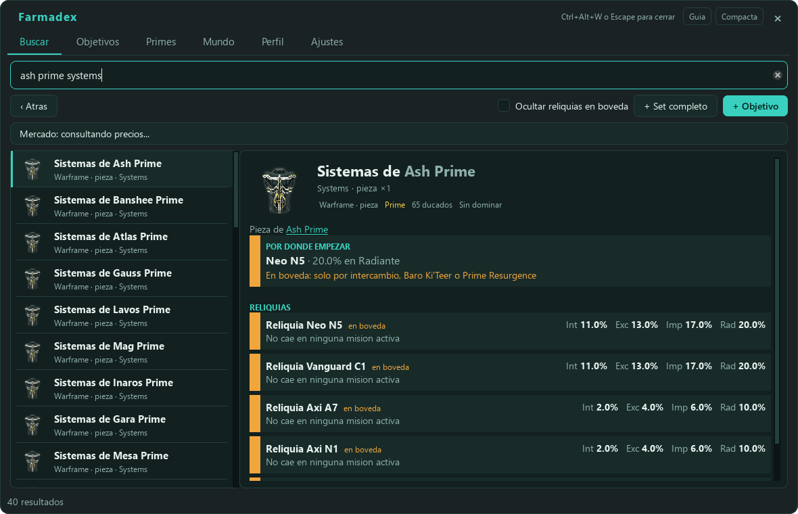

# Farmadex

Overlay en español para Warframe: escribes cualquier cosa del juego y te dice
de dónde sale. Apunta lo que estás farmeando, ve qué hacer ahora mismo con las
fisuras y el resto del mundo, y lee la pantalla de recompensas de una
reliquia para saber qué son. Pensado para no tener que salir de la partida ni
pelearse con el códice, que cuenta la mitad de lo que necesitas.

## Descargar

**[Descargar la última versión](https://github.com/angelsanchez97/farmadex/releases/latest)**
(instalador o zip portable). Windows 10/11 de 64 bits.

## Documentación

- **[Manual de usuario](docs/MANUAL.md)**: qué hace cada pestaña, atajos de
  teclado, cómo funciona la lectura de pantalla y problemas frecuentes.
- **[Guía de instalación](docs/INSTALACION.md)**: paso a paso, el aviso de
  SmartScreen, cómo actualizar y desinstalar, la versión portable y cómo
  ejecutarlo desde el código fuente.

## Aviso legal

Farmadex **no está afiliado a Digital Extremes** ni tiene su respaldo. Warframe y
todo su contenido son propiedad de Digital Extremes.

El programa **no modifica el juego de ninguna forma**: no lee ni escribe en la
memoria del proceso, no inyecta nada, no envía pulsaciones ni clics al juego, no
automatiza ninguna acción y no usa las credenciales de tu cuenta. Lo único que
hace es (1) capturar píxeles de la pantalla cuando tú se lo pides o cuando se
abre la pantalla de recompensas, para leerlos con OCR, y (2) mirar las líneas
nuevas de `EE.log`, el registro que el propio juego escribe, del que solo se
reconocen mensajes concretos de la interfaz. Ese fichero contiene datos
personales (correo e IP): su contenido no se copia, ni se enseña, ni sale de tu
equipo.

Aun así, usarlo es responsabilidad tuya, conforme a la política de software de
terceros de Digital Extremes.

## Datos y licencias

Los datos del juego salen de proyectos abiertos, y se descargan directamente de
ellos:

- [WFCD/warframe-items](https://github.com/WFCD/warframe-items) — catálogo de
  objetos y traducciones (MIT).
- [WFCD/warframe-drop-data](https://github.com/WFCD/warframe-drop-data) — tablas
  de drops oficiales de Digital Extremes (MIT).
- [warframestat.us](https://docs.warframestat.us/) — estado del mundo
  (Apache-2.0).
- [warframe.market](https://warframe.market/) — precios en platino.
- Public Export de Digital Extremes — nombres del mapa estelar en español.

Y estas son las bibliotecas que lleva dentro:

- PySide6 / Qt for Python (LGPL-3.0; se enlaza dinámicamente y se distribuye sin
  modificar).
- RapidOCR y ONNX Runtime (Apache-2.0) para leer la pantalla.
- httpx (BSD-3), RapidFuzz (MIT), mss (MIT), OpenCV (Apache-2.0).

Para compilarlo tú mismo o trabajar en el código, mira el apartado final de la
[guía de instalación](docs/INSTALACION.md).
