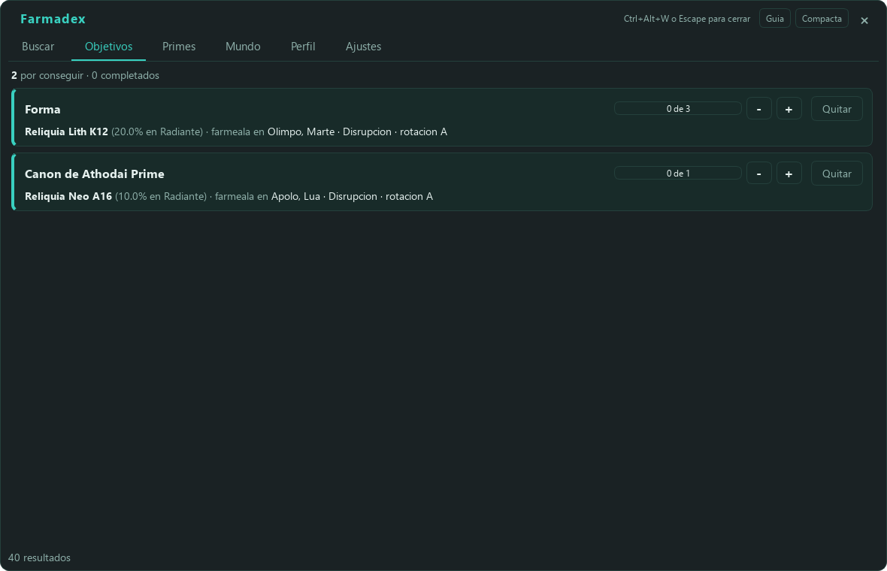
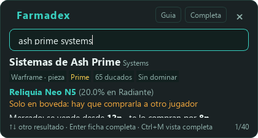

# Farmadex

El códice de Warframe te dice que los Sensores neuronales existen, pero no
dónde farmearlos. Así que acabas como yo: con la wiki abierta en la otra
pantalla, saliendo de la partida cada dos por tres y haciendo cuentas de
cabeza para saber si compensa más un 10 % en una misión de diez minutos o un
20 % en una de cuarenta.

Farmadex es lo que me hice para dejar de hacer eso. Es una ventana en español
que se abre encima del juego con `Ctrl+Alt+W`, le escribes lo que buscas y te
dice adónde ir y cuánto vas a tardar.

**[Descargar la última versión](https://github.com/angelsanchez97/farmadex/releases/latest)**
· Windows 10/11 de 64 bits · [Manual](docs/MANUAL.md) · [Guía de instalación](docs/INSTALACION.md)

## Buscas algo y te dice adónde ir

Escribes «sensores neuronales» y lo primero que ves es **Alad V (Temisto,
Júpiter) · Asesinato · 97,4 % · ~10 min**. Debajo, que también caen en
cualquier misión de Júpiter y cuáles son las más cortas allí (Ananké, una
Captura de unos 3 minutos), y luego el resto de sitios: Formido en Deimos,
los contratos de Cetus, el Raptor de Europa.

Todo va ordenado por el tiempo medio que tardas en conseguirlo, no por el
porcentaje. Un 97 % en un jefe son diez minutos; un 19,4 % en la rotación C de
Formido son unos 70, porque cada partida hasta la C dura unos 13 minutos y
hacen falta cinco de media. La barra de cada fila te lo enseña de un vistazo,
y si pasas el ratón por un tiempo te dice de dónde sale la cuenta:

Son medias para un jugador medio. Si vas más rápido o más tranquilo, en
Ajustes > Ritmo de juego eliges Rápido (x0,7), Normal o Tranquilo (x1,4) y
todos los tiempos se ajustan; las probabilidades y el orden no cambian.

Entiende erratas, nombres en inglés y cosas como «chasis de mesa prime» o
«plano del rhino». Si es una pieza Prime, te dice en qué reliquias cae, con la
probabilidad de cada refinamiento, cuáles están en bóveda y su precio en
warframe.market.

## Primes: marcas lo que te falta

Una caja por cada Prime y una casilla por pieza, como el Relicario de
wf.xuerian.net. Marco el Plano de Caliban Prime y pulso «Dónde farmear»:

Sale en Lith V11, Meso V13 y Meso V15 (20 % en Radiante); Meso V11 y
Vanguard M1 también lo llevan, pero están en bóveda y no cuentan. Y lo más
rápido es Io, en Júpiter: Defensa, rotación A, unos 48 minutos hasta tener la
pieza, contando las reliquias que tienes que farmear y las fisuras que tienes
que hacer para abrirlas. Pasando el ratón por ese tiempo ves la cuenta paso a
paso. Arriba eliges el refinamiento y si vas solo o en escuadra compartiendo
reliquia, y el orden cambia.

Lo que marcas aquí se apunta como objetivo, así que lo ves también en
Objetivos y en Mundo.

## Encima de la reliquia, cuál coger

Cuando se abre la pantalla de recompensas de una fisura, Farmadex pone debajo
de cada tarjeta lo que necesitas para elegir: platino (la venta más barata en
warframe.market), ducados, si está en bóveda, si te sirve para un objetivo,
cuántas tienes y si ya lo has dominado. La que más vale lleva el borde dorado.
No hay que pulsar nada: el propio juego apunta en su registro qué ha salido, y
el veredicto llega en menos de un segundo.

En la captura, las tarjetas grises de arriba imitan las del juego; lo de abajo
es Farmadex. Si prefieres algo más discreto, en Ajustes lo cambias por una
etiqueta pequeña encima de cada recompensa.

## Objetivos y Mundo

En Objetivos se queda apuntado lo que estás farmeando, con la mejor ruta de
ahora mismo: «Forma: Reliquia Lith K12 (20 % en Radiante), farméala en Olimpo,
Marte, Disrupción, rotación A». Si abres una reliquia en solitario, lo que te
toca se suma solo.

Mundo es lo que hay abierto ahora: fisuras por era y por modo, con cuenta
atrás, los ciclos de Cetus, el Valle del Orbe y Cambion, Baro Ki'Teer,
incursión, arcontes y demás. Arriba del todo, **Para tus objetivos** te dice
qué fisuras abiertas sirven para lo que tienes apuntado. Lo que caduca en
menos de diez minutos sale en naranja. Si la API de la comunidad se queda
atascada, tira de la fuente oficial de DE.

## Para jugar o para directo: modo compacto

Con `Ctrl+M` la ventana se queda en una cajita de 560×250 con la búsqueda y lo
justo: dónde conseguirlo, si está en bóveda y el precio. No tapa medio juego ni
media escena de OBS.

## Lo demás

- **Perfil.** Cuando abres Perfil > Equipamiento en el juego, Farmadex lee
  solo lo que tienes dominado. Con eso, las fichas y las recompensas te dicen
  si algo ya lo tienes.
- **`Ctrl+Alt+Q`** lee el nombre que tengas bajo el cursor (en el inventario,
  en el mercado, donde sea) y abre su ficha.
- **Glosario.** «Rotación», «refinamiento», «bóveda», «ducados»... salen
  subrayados; pasa el ratón y te lo explica en una línea.
- **Idiomas y temas.** Español, inglés, francés, alemán y portugués de Brasil,
  y tres colores: Vacío (azul), Orokin (dorado, el de las capturas de Primes) y
  Tenno (turquesa).
- **Se actualiza solo.** Descarga la versión nueva en segundo plano, comprueba
  su huella SHA-256 contra la que publica GitHub y se instala al cerrar
  Farmadex, nunca en mitad de una partida. Se puede desactivar en Ajustes.

## Descargar e instalar

1. Baja `Farmadex-X.X.X-setup.exe` de la
   [última versión](https://github.com/angelsanchez97/farmadex/releases/latest)
   (o el `.zip` portable si no quieres instalar nada).
2. Windows te va a enseñar un aviso de **SmartScreen**: el instalador no está
   firmado, porque el certificado cuesta cientos de euros al año. Pulsa
   «Más información» y luego «Ejecutar de todas formas». No pide permisos de
   administrador.
3. La primera vez descarga los datos del juego; tarda unos minutos.

Necesitas Windows 10 u 11 de 64 bits y Warframe en **ventana** o **ventana sin
bordes**. En pantalla completa exclusiva ningún programa puede dibujar encima
del juego; se cambia en Opciones > Pantalla.

Todo lo demás (atajos, qué hace cada pestaña, problemas frecuentes, cómo
desinstalar) está en el [manual](docs/MANUAL.md) y en la
[guía de instalación](docs/INSTALACION.md).

## Farmadex y Digital Extremes

Farmadex no hace nada de lo que la política de DE persigue: no lee ni escribe
la memoria del juego, no modifica sus ficheros, no inyecta nada, no pulsa
teclas ni automatiza nada, y no toca tu cuenta. Solo mira la pantalla y el
registro que escribe el propio juego (`EE.log`), lo mismo que llevan años
haciendo WFInfo y AlecaFrame. Hasta donde sabemos, no incumple el EULA.

Aun así, DE no garantiza nada a ningún programa de terceros («we do not
endorse any use of third-party software», «at your own risk»), así que la
decisión es tuya. Esta es la respuesta que me dio su soporte cuando les
pregunté por programas de terceros:

Su postura oficial está en
[Third Party Software and You](https://support.warframe.com/hc/en-us/articles/360030014351-Third-Party-Software-and-You).
Dentro del programa tienes lo mismo en Ajustes > Acerca de Farmadex.

Farmadex no está afiliado a Digital Extremes ni tiene su respaldo. Warframe y
todo su contenido son propiedad de Digital Extremes.

`EE.log` contiene tu correo y tu IP: de ese fichero solo se reconocen unos
pocos mensajes del juego, y nada de él se copia, se enseña ni sale de tu
equipo. Las capturas de pantalla se leen en tu propio ordenador y no se
guardan.

## Sobre el proyecto

Lo he hecho yo, jugando, para mí y para quien le sirva. Lo he hecho con ayuda
de Claude, que ha escrito buena parte del código conmigo. Si algo falla o
echas algo en falta, abre un
[issue](https://github.com/angelsanchez97/farmadex/issues).

Para compilarlo o trabajar en el código, mira el apartado final de la
[guía de instalación](docs/INSTALACION.md).

## Datos y licencias

Los datos del juego salen de proyectos abiertos y se descargan directamente
de ellos:

- [WFCD/warframe-items](https://github.com/WFCD/warframe-items): catálogo de
  objetos y traducciones (MIT).
- [WFCD/warframe-drop-data](https://github.com/WFCD/warframe-drop-data): tablas
  de drops oficiales de Digital Extremes (MIT).
- [warframestat.us](https://docs.warframestat.us/): estado del mundo
  (Apache-2.0).
- [warframe.market](https://warframe.market/): precios en platino.
- Public Export de Digital Extremes: nombres del mapa estelar en español, y
  estado del mundo cuando la API de la comunidad falla.

Bibliotecas que lleva dentro:

- PySide6 / Qt for Python (LGPL-3.0; se enlaza dinámicamente y se distribuye
  sin modificar).
- RapidOCR y ONNX Runtime (Apache-2.0) para leer la pantalla.
- httpx (BSD-3), RapidFuzz (MIT), mss (MIT), OpenCV (Apache-2.0).
