# Farmadex

El códice de Warframe te dice que los Sensores neuronales existen, pero no
dónde farmearlos. Así que acabas como yo: con la wiki abierta en la otra
pantalla, saliendo de la partida cada dos por tres y echando cuentas de
cabeza para saber si compensa más una misión corta con poca suerte o una
larga con mucha.

Farmadex es lo que me hice para dejar de hacer eso. Es una ventana en español
que se abre encima del juego con `Ctrl+Alt+W`: escribes lo que buscas y te
dice adónde ir y cuánto vas a tardar, más o menos.

**[Descargar la última versión](https://github.com/angelsanchez97/farmadex/releases/latest)**
· Windows 10/11 · [Manual](docs/MANUAL.md) · [Guía de instalación](docs/INSTALACION.md)
· [¿Es seguro?](docs/SEGURIDAD.md)

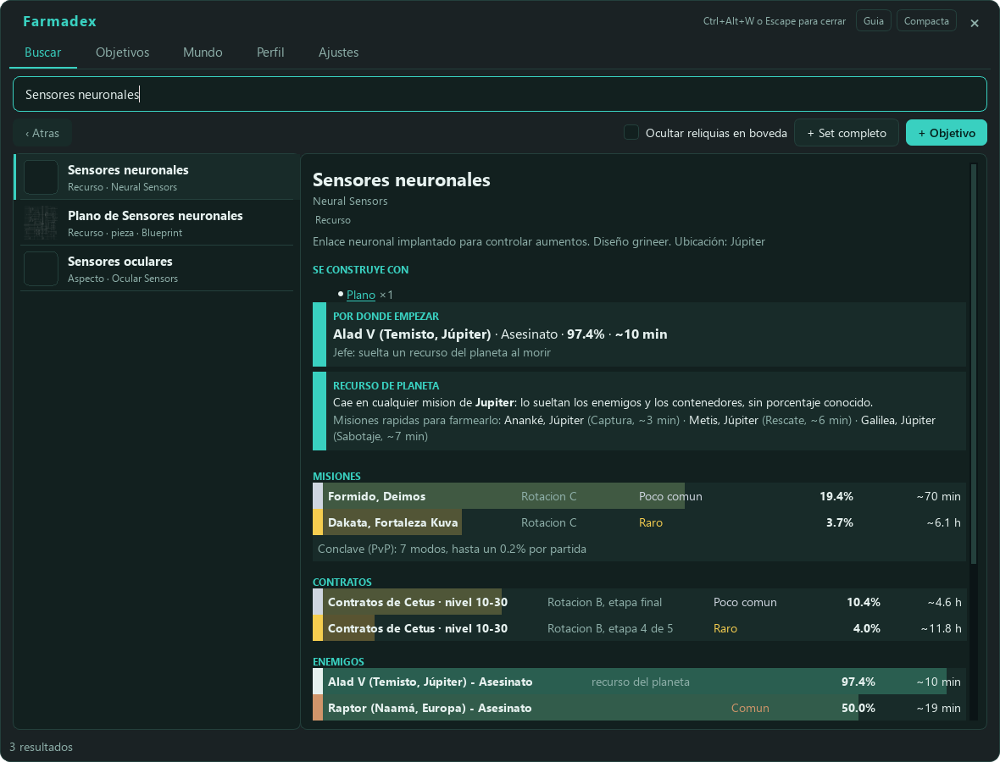

## Buscas algo y te dice adónde ir

Escribes «sensores neuronales» y lo primero que sale es Alad V, en Júpiter.
Debajo, que también caen en cualquier misión del planeta y cuáles son las más
cortas, y luego el resto de sitios donde puedes conseguirlos.

Lo importante es el orden: no va por probabilidad, va por lo que vas a tardar
de verdad. Una rotación C con buena pinta sobre el papel puede ser una hora de
partida; un jefe que suelta la pieza casi siempre, diez minutos. La barra de
cada fila te lo enseña de un vistazo, y si pasas el ratón por encima del
tiempo te explica de dónde sale la cuenta.

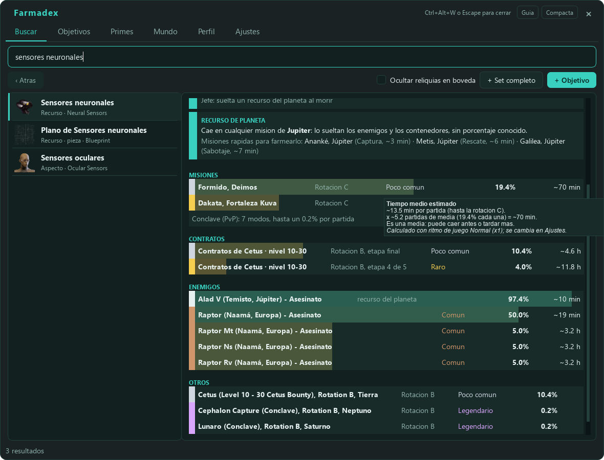

Los tiempos son para alguien que juega a un ritmo normal. Si vas más rápido o
más tranquilo, lo cambias en Ajustes > Ritmo de juego y todo se recalcula.

Entiende erratas, nombres en inglés y cosas como «chasis de mesa prime» o
«plano del rhino». Si es una pieza Prime, te dice en qué reliquias cae, cuáles
están en bóveda y cuánto piden por ella en warframe.market.

## Cada cosa con su color

Busca «sierra» y te salen el mod Sierra, la Sierra espectral, un aspecto con
«sierra» en el nombre... Antes tenías que leer cada línea para saber qué era
cada cosa. Ahora cada tipo lleva su color (los recursos en amarillo, los mods
en azul, las armas en naranja...) y encima de la lista tienes la leyenda.
Pensado sobre todo para quien empieza y todavía no sabe si algo es un mod o
un arma.

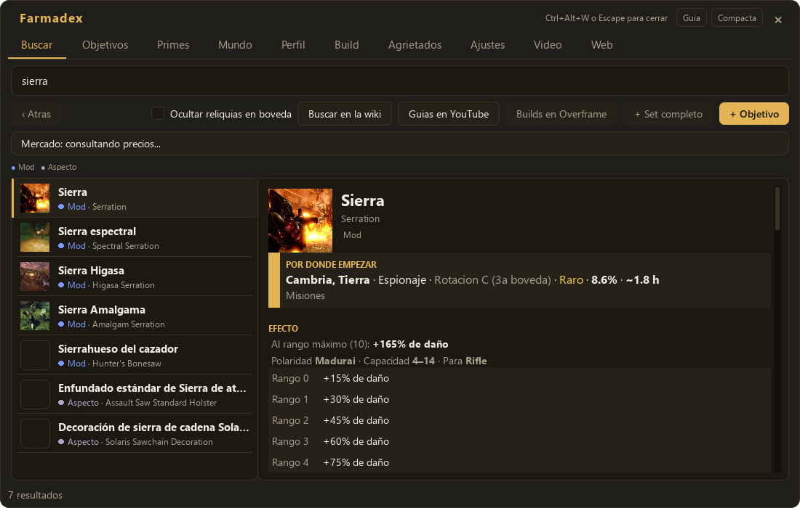

## Lo que antes tenías que mirar en la wiki

La ficha ya no se queda en «dónde sale». Si buscas un arma, ves sus
estadísticas (daño, crítico, estado, cadencia...) y su disposición de riven,
con los puntitos de siempre. Un mod te enseña lo que hace en cada rango, un
arcano su efecto, y un warframe lo básico y sus habilidades.

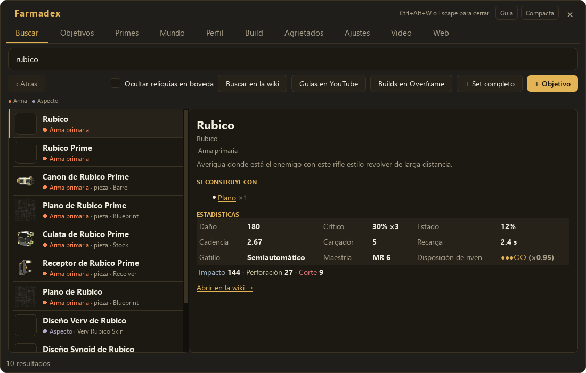

Los glifos de creadores de contenido traen su código y un botón **Copiar**:
lo pegas en el Mercado del juego o en la web de Warframe y listo.

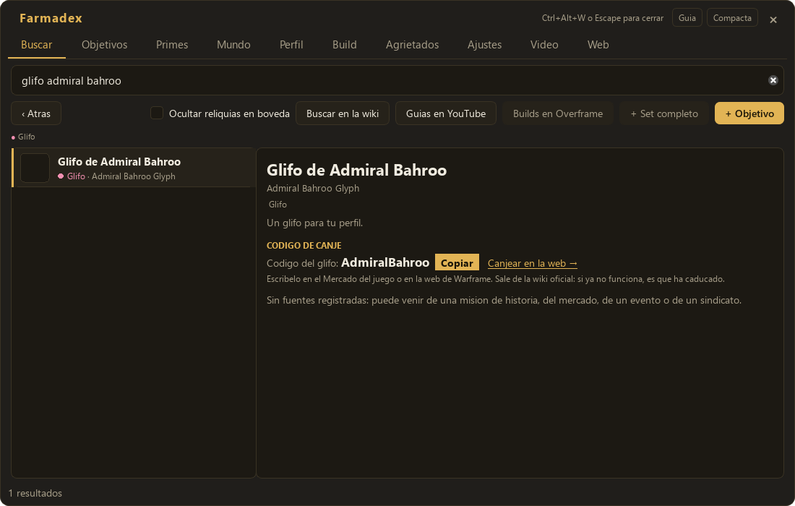

Y los nombres son los del juego en castellano: Interrupción, Interceptación,
Usurpación... Si escribes el nombre antiguo o el inglés, te lo encuentra
igual.

## Y cuándo cae, sin tener que mirar la wiki

Lo que más me hacía salir del juego no era saber la misión, era saber
*cuándo*: ¿esto es rotación C?, ¿y eso cuánto rato de Supervivencia es?, ¿en
Interrupción cómo iba lo de los conductos? Por eso cada fila lo lleva al lado.

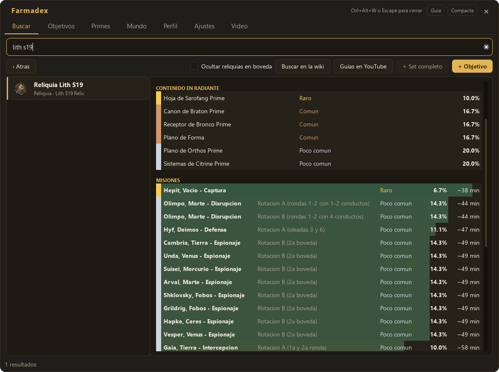

En una Supervivencia te dice a partir de qué minuto sale; en una Defensa, tras
qué oleadas; en una Interrupción, en qué ronda y cuántos conductos tienes que
salvar. Y el nombre de cada nodo y de cada tipo de misión lleva a su página de
la wiki oficial por si quieres leer más.

## Misiones: escribes el nodo y te cuenta cómo va

También puedes buscar una misión por su nombre («Olimpo», «Hepit») o por su
tipo («supervivencia», «interrupción»). La ficha te explica qué hay que hacer,
cómo van las recompensas y qué suelta cada rotación. En las que tienen
truco, como la Interrupción, viene también la tabla de rondas y conductos.

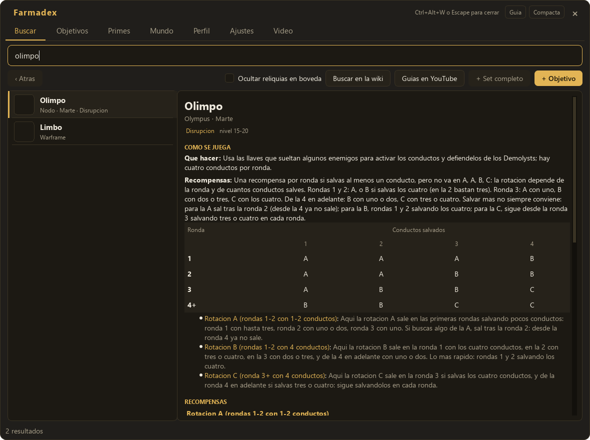

La idea es que alguien que acaba de empezar pueda entrar en una Interrupción
sabiendo a qué va, y que quien ya la conoce sepa en qué ronda salir con lo
que quiere.

## Pregúntale como hablas

No hace falta escribir el nombre exacto. «Cómo sacar citrine prime» te abre
la Citrine con por dónde empezar pieza a pieza, y «el último warframe» o
«novedades» te enseñan lo que ha salido en la última actualización.

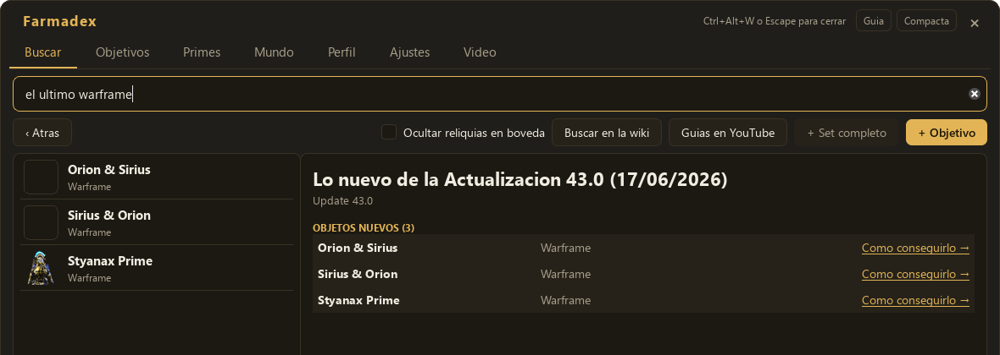

Con el buscador vacío, arriba de la ficha tienes una línea con las
novedades, para que lo recién salido no se te pase.

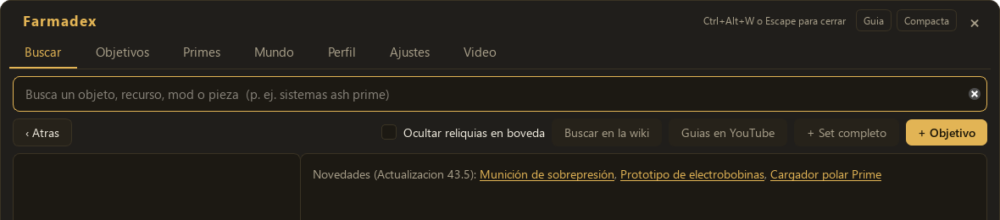

## La wiki y las guías de YouTube, a un botón

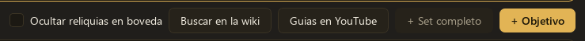

Hay cosas que Farmadex no cuenta y no va a contar: las habilidades de un
warframe, cómo se construye algo, la historia de una misión. Para eso está
**Buscar en la wiki**, que abre la página de la wiki oficial de lo que tengas
en pantalla.

Y **Guías en YouTube** busca vídeos de esa misión u objeto y los pone en la
pestaña Vídeo, dentro de Farmadex. Si juegas con un solo monitor, como yo
muchas veces, el **modo vídeo** deja la ventana solo con el vídeo encima del
juego: vas siguiendo la guía mientras juegas y con el atajo lo escondes y lo
vuelves a sacar. Si en tu equipo no se puede ver ahí, te ofrece abrirlo en el
navegador.

## Primes: marcas lo que te falta

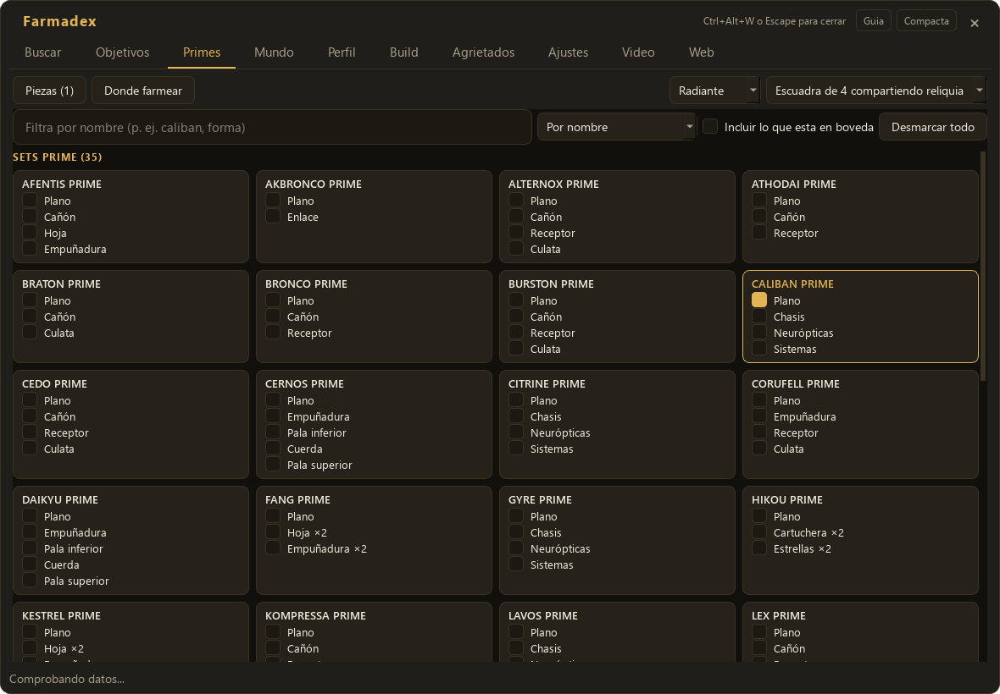

Una caja por cada Prime y una casilla por pieza, al estilo del Relicario de
wf.xuerian.net. Marcas lo que te falta, pulsas «Dónde farmear» y te dice qué
reliquias lo llevan y dónde conseguirlas antes, contando también el tiempo de
hacer las fisuras para abrirlas.

Las cajas van en una cuadrícula ordenada, todas del mismo ancho, como las
celdas de una hoja de cálculo. Las Formas y los Adaptadores Exilus, que no son
de ningún set, van aparte al final. Y arriba eliges cómo ordenarlo: por
nombre, lo que tienes marcado primero, los que tienen más piezas en búsqueda,
los más nuevos o lo que acabas de conseguir.

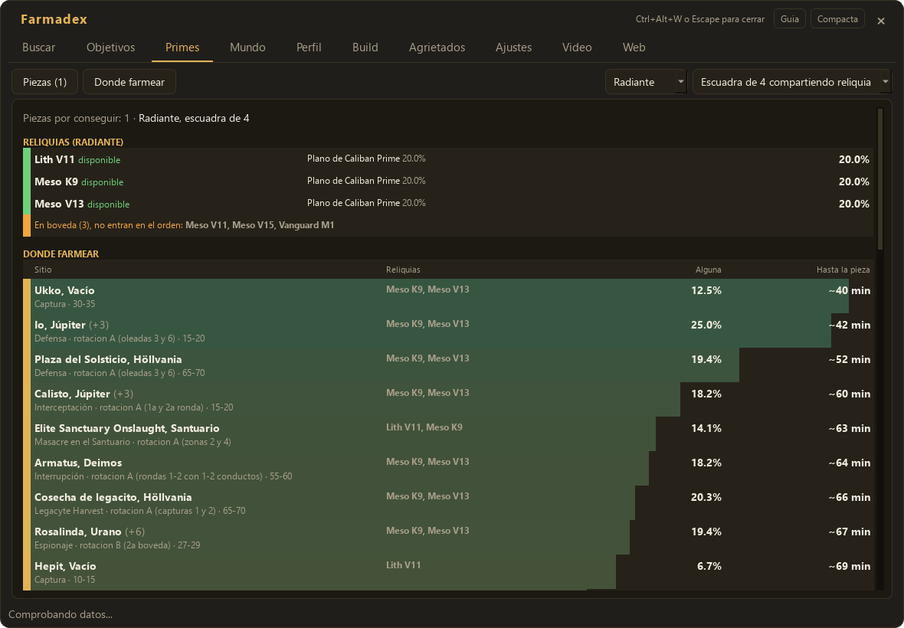

Las reliquias en bóveda se enseñan pero no cuentan. Arriba eliges el
refinamiento y si vas solo o en escuadra, y el orden se ajusta. Lo que marcas
se queda apuntado como objetivo. Si activas «Incluir lo que está en bóveda»,
el botón se queda quieto mientras carga, para que no lo pulses dos veces
pensando que no ha hecho caso.

Qué está en bóveda lo decide mirando dónde cae cada reliquia en las tablas
oficiales: si todavía se puede farmear, no está en bóveda. Así lo recién
salido, como las reliquias de la Citrine Prime, no se te esconde, y la
búsqueda, Primes, Objetivos y las recompensas dicen siempre lo mismo.

## Al abrir una reliquia, cuál coger

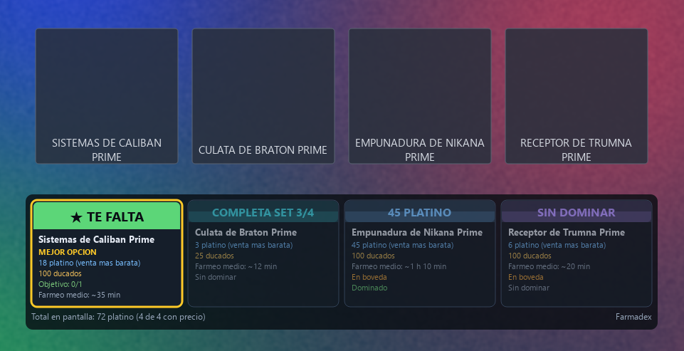

Cuando sale la pantalla de recompensas de una fisura, Farmadex pone debajo de
cada tarjeta lo que necesitas para decidir: cuánto platino vale, cuántos
ducados da, si está en bóveda, si te sirve para algo que estés farmeando y si
ya la tienes. Arriba de cada tarjeta, en grande y de color, el motivo que
importa: «TE FALTA», «COMPLETA SET», el platino o los ducados. La mejor lleva
una estrella y el borde dorado, y el resto se apaga un poco para que no
distraiga. No hay que pulsar nada y aparece al momento.

Lo que se considera «mejor» lo eliges tú en Ajustes, con un solo desplegable:
lo que te falta para tus Primes, más platino, más ducados o un equilibrio
entre todo.

En la captura, las tarjetas grises de arriba imitan las del juego; lo de abajo
es Farmadex. Si te parece mucho, en Ajustes lo puedes dejar en una etiqueta
pequeña encima de cada recompensa.

## Objetivos: tu lista de farmeo, ordenada

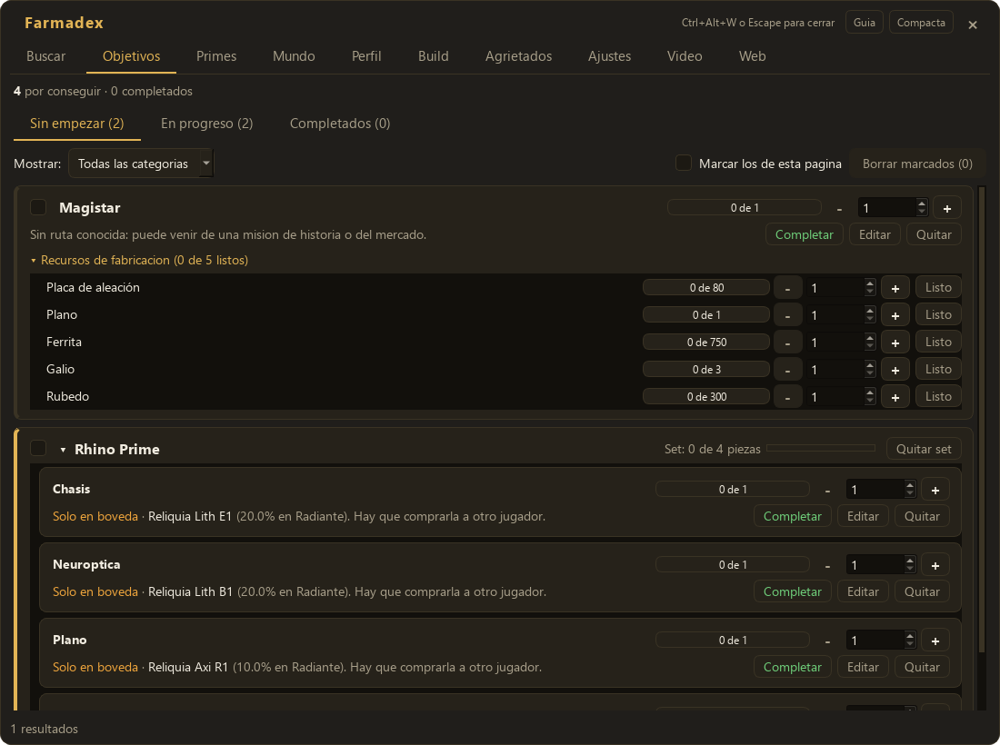

En Objetivos tienes apuntado lo que estás farmeando, cada cosa con la mejor
forma de conseguirla ahora mismo. Si abres una reliquia en solitario, lo que
te toca se descuenta solo.

- **Cuántos quieres, de verdad.** Si quieres farmear quinientas de Criótica,
  pones quinientas. Puedes sumar de golpe lo que has sacado en una partida en
  vez de ir de uno en uno, y el contador no se pasa de la meta.
- **Sin empezar, En progreso y Completados**, en pestañas. Lo terminado no
  desaparece, por si te equivocaste y quieres corregirlo.
- **Un set es un solo panel**: lo abres con un clic y dentro están sus piezas.
- **Armas con receta**: puedes marcar el arma entera o abrir sus recursos y
  apuntar cada uno por separado. Muy útil con esas armas que se comen montañas
  de un material concreto.
- **Filtro por categoría y de diez en diez**, con lo último que añadiste
  arriba, para no hacer scroll infinito.
- **Nada se borra sin querer**: antes de quitar algo te pregunta, y si quieres
  limpiar la lista puedes marcar varios y borrarlos juntos.

## Mundo: lo que hay ahora, y que te avise

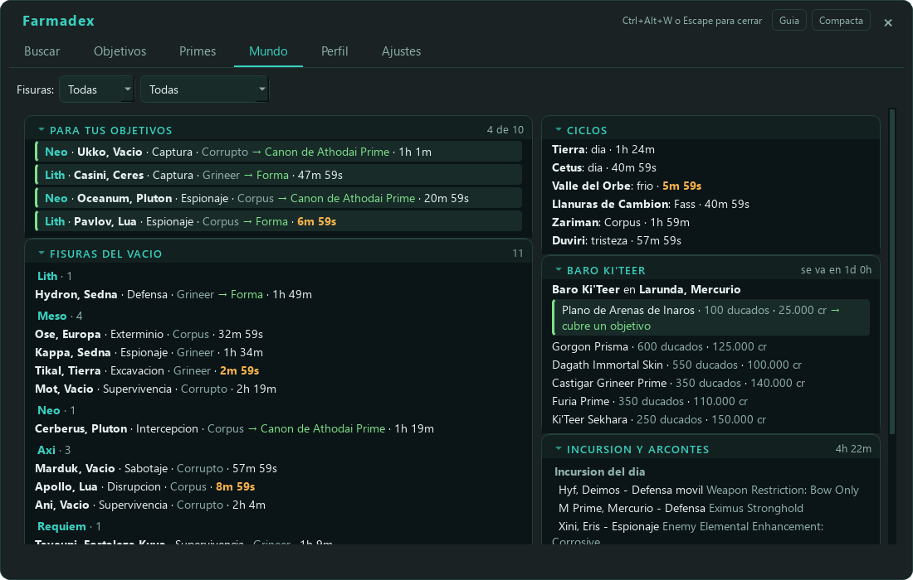

Mundo es lo que hay abierto en este momento: fisuras con su cuenta atrás, los
ciclos de Cetus, el Valle del Orbe y Cambion, Baro Ki'Teer, la incursión y
demás. Arriba del todo te dice qué fisuras abiertas te sirven para lo que
tienes apuntado, y lo que está a punto de acabar sale en naranja. Cada
facción lleva su color y puedes quedarte solo con las que te interesen, y si
pulsas una recompensa se abre su ficha.

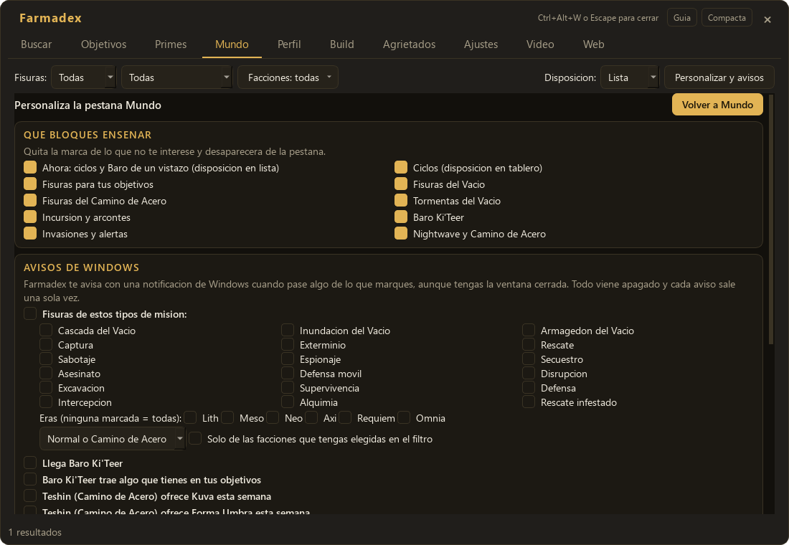

Pero lo mejor es que ya no tienes que ir a mirarlo. En **Personalizar y
avisos** eliges qué te interesa y Windows te avisa aunque tengas la ventana
escondida: «ha llegado Baro», «Baro trae algo que tienes en tus objetivos»,
«hay una fisura Axi de Supervivencia», «esta semana Teshin tiene Forma
Umbra», «se hace de noche en Cetus»... También hay avisos para las invasiones,
las alertas, los arbitrajes, la incursión y los arcontes. Todo viene apagado
y cada aviso sale una sola vez. Desde ahí también escondes los bloques que no
uses, y eliges si lo quieres en lista o en tablero sin salir de la pestaña.

## Build: los mods de una build, con un atajo

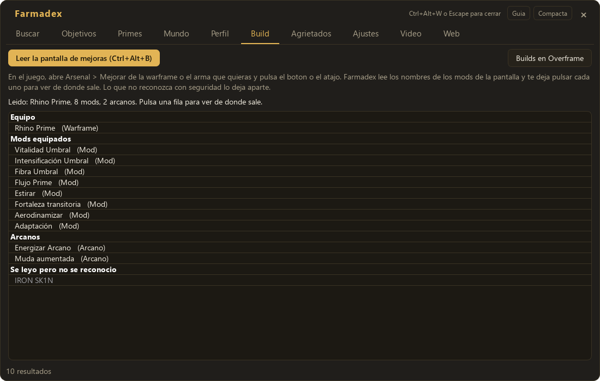

¿Estás viendo la build de alguien y no sabes de dónde sale medio mod? Abre en
el juego la pantalla de mejoras de ese warframe o esa arma y pulsa
`Ctrl+Alt+B`. Farmadex lee los mods y los arcanos que se ven, te los lista y
al pulsar uno te abre su ficha con dónde conseguirlo. Lo que no reconoce con
seguridad lo pone aparte, sin inventárselo.

¿Quieres ver cómo la lleva otra gente? El botón «Builds en Overframe» te abre
las builds de ese warframe o esa arma dentro de Farmadex, en la pestaña Web.
El mismo botón está en la ficha de cualquier warframe o arma en Buscar.

## Agrietados: ¿es bueno este riven?

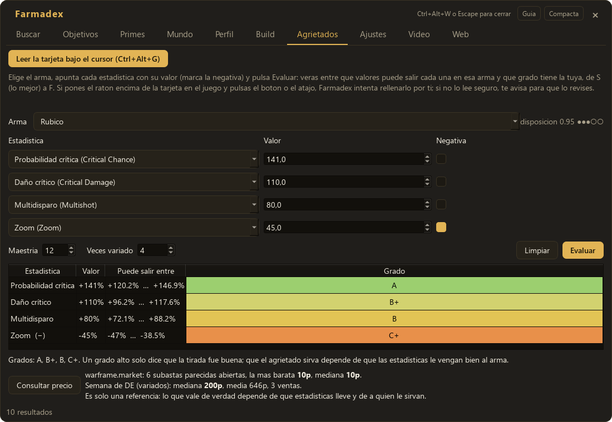

Te ha salido un mod agrietado y no sabes si es una joya o para disolver. Pon
el ratón encima de la tarjeta en el juego y pulsa `Ctrl+Alt+G`, o apunta las
estadísticas a mano. Farmadex te dice, para cada una, entre qué valores puede
salir en esa arma y qué nota tiene la tuya, de S (lo mejor) a F. Y con
«Consultar precio» te da una referencia de lo que se pide en warframe.market
por rivens parecidos.

Si lo que lee de la pantalla no le cuadra, no se lo inventa: te avisa para
que lo revises antes de evaluar.

## Para jugar o para directo: modo compacto

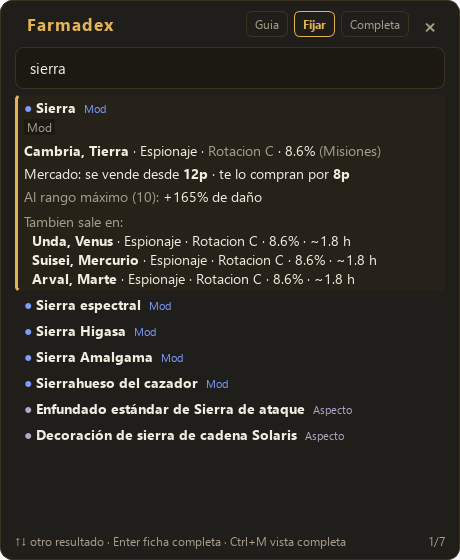

Con `Ctrl+M` la ventana se queda en una cajita con la búsqueda y lo justo. No
te tapa medio juego ni media escena de OBS.

Salen todos los resultados en lista, cada uno con su color, y al pulsar uno
se despliegan sus detalles justo debajo: dónde se consigue, con qué suerte, el
precio, lo que hace... sin perder la búsqueda. Y con la chincheta **Fijar** se
queda siempre encima del juego, para consultarla sin cambiar de ventana.

## A tu gusto

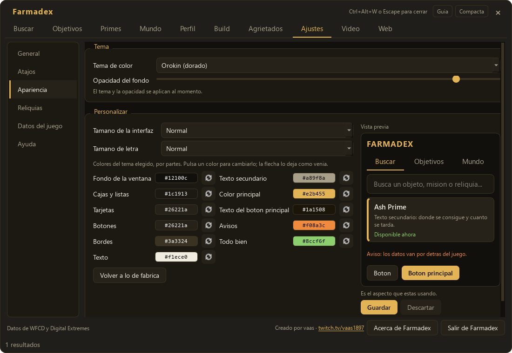

Ajustes va ahora por secciones, en una columna a la izquierda, y cada opción
explica para qué sirve. Lo que casi nadie necesita está en un apartado
«Avanzado» plegado, para que no estorbe.

En Apariencia puedes hacer la ventana y la letra más grandes (o más
pequeñas) y cambiar cualquier color del tema. Lo ves antes en la vista
previa, y no se aplica hasta que pulsas Guardar. Si te lías, «Volver a lo de
fábrica» lo deja como estaba.

## La primera vez

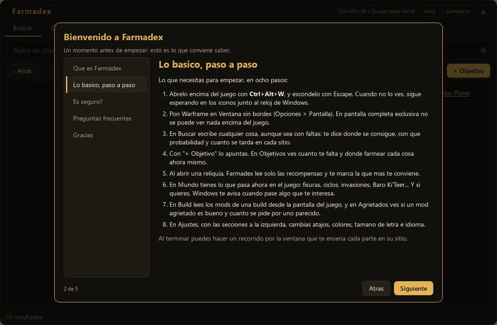

Al abrirlo por primera vez te recibe una bienvenida que te cuenta qué es
Farmadex, lo básico para empezar, si es seguro y las dudas más típicas.
Después te ofrece un recorrido por la ventana que te señala cada parte en su
sitio, también las nuevas: Build, Agrietados, los avisos de Mundo y cómo
cambiar el aspecto. Las dos se pueden volver a ver cuando quieras desde
Ajustes > Ayuda o con el botón «Guía».

## Lo demás

- **Perfil.** Si abres Perfil > Equipamiento en el juego, Farmadex apunta lo
  que ya tienes dominado, y a partir de ahí te lo recuerda en las fichas y en
  las recompensas.
- **`Ctrl+Alt+Q`** lee el nombre que tengas bajo el cursor (inventario,
  mercado, donde sea) y te abre su ficha.
- **Glosario.** Palabras como «rotación», «refinamiento» o «bóveda» salen
  subrayadas; pasas el ratón y te lo explica en una línea. Pensado para quien
  empieza.
- **Misiones explicadas al pasar el ratón.** Pasas el ratón por
  «Supervivencia», «Defensa» o «Interrupción» y te dice qué hay que hacer y
  cómo van sus recompensas, estés en la pestaña que estés.
- **Una ventana de verdad.** La mueves y le cambias el tamaño arrastrando
  desde cualquier borde, como cualquier programa. Y si le das otra vez al
  acceso directo con Farmadex ya abierto, te saca el que ya tenías en vez de
  abrir otro.
- **Si al abrir una reliquia no sale nada.** En Ajustes hay un «Diagnóstico
  de reliquias» que comprueba paso a paso si Farmadex ve el juego y te dice
  qué falla. Si no das con ello, te guarda un informe para mandármelo, sin
  nada de tu cuenta.
- **Idiomas y colores.** Español, inglés, francés, alemán y portugués, y cuatro
  temas de color: Vacío, Orokin, Tenno y Cherry, que puedes retocar a tu gusto.
- **Se actualiza solo.** Baja la versión nueva por detrás y se instala cuando
  cierras Farmadex, nunca en mitad de una partida. La versión vieja se cierra
  del todo y no deja restos. Se puede desactivar.

## Descargar e instalar

1. Baja el instalador de la
   [última versión](https://github.com/angelsanchez97/farmadex/releases/latest)
   (o el `.zip` portable si no quieres instalar nada).
2. Ábrelo. Windows seguramente te enseñe un aviso azul; más abajo te explico
   por qué y qué hacer. No pide permisos de administrador.
3. La primera vez descarga los datos del juego y tarda un poco. Al pasar a
   una versión nueva a veces los vuelve a preparar una vez; es normal.

Warframe tiene que estar en **ventana** o **ventana sin bordes**; en pantalla
completa ningún programa puede dibujar encima. Se cambia en Opciones >
Pantalla.

Atajos, qué hace cada pestaña, problemas frecuentes y cómo desinstalar: en el
[manual](docs/MANUAL.md) y la [guía de instalación](docs/INSTALACION.md).

## Windows dice que puede ser peligroso

Es normal y tiene explicación. Al abrir el instalador, Windows enseña un
aviso azul que dice «Windows protegió tu PC». Es **SmartScreen**, y sale con
los programas nuevos que no llevan una firma digital de pago. Farmadex no la
lleva porque es gratis, lo hago yo solo y ese certificado cuesta bastante
dinero cada año.

El aviso no quiere decir que tenga un virus, solo que Windows todavía no
conoce el programa. Para seguir:

1. Pulsa **«Más información»**.
2. Pulsa **«Ejecutar de todas formas»**.

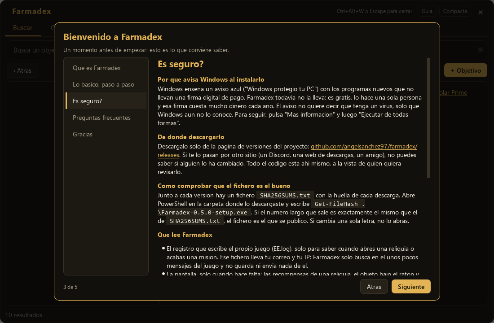

Si quieres quedarte tranquilo del todo:

- **Descárgalo solo de aquí**, de la
  [página de versiones de GitHub](https://github.com/angelsanchez97/farmadex/releases).
  Si te lo pasan por un Discord o una web de descargas, no puedes saber si
  alguien lo ha tocado.
- **Comprueba que el fichero es el bueno.** Junto a cada versión hay un
  `SHA256SUMS.txt` con la «huella» de cada descarga. Si la de tu fichero
  coincide, es exactamente el que yo subí.
- **Todo el código está a la vista** en este mismo repositorio.

En [¿Es seguro Farmadex?](docs/SEGURIDAD.md) tienes todo esto paso a paso,
con cómo sacar la huella en tu ordenador, qué lee el programa, qué guarda y
qué no toca. Lo mismo está resumido dentro de la app, en la bienvenida y en
Ajustes > Acerca de Farmadex.

## Farmadex y Digital Extremes

Farmadex no toca el juego: no lee ni escribe su memoria, no modifica sus
ficheros, no inyecta nada, no pulsa teclas por ti y no entra en tu cuenta.
Solo mira la pantalla y el registro que escribe el propio juego (`EE.log`),
igual que llevan años haciendo WFInfo y AlecaFrame. Hasta donde sabemos, no
incumple el EULA.

Aun así, DE no da garantías a ningún programa de terceros, así que la
decisión de usarlo es tuya. Esto es lo que me contestó su soporte cuando les
pregunté:

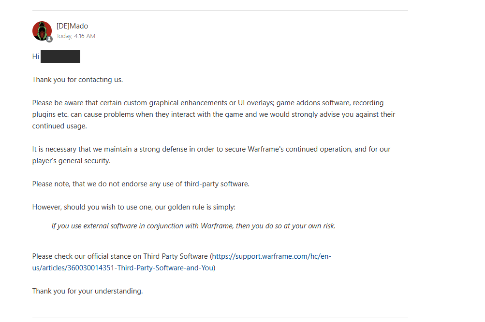

Su postura oficial está en
[Third Party Software and You](https://support.warframe.com/hc/en-us/articles/360030014351-Third-Party-Software-and-You),
y dentro del programa la tienes en Ajustes > Acerca de Farmadex.

Farmadex no está afiliado a Digital Extremes ni tiene su respaldo. Warframe y
todo su contenido son de Digital Extremes.

Sobre tus datos: `EE.log` contiene tu correo y tu IP, pero de ese fichero
solo se buscan unos pocos mensajes del juego y nada sale de tu ordenador. Las
capturas de pantalla se leen en tu equipo y no se guardan. Más detalle en
[¿Es seguro Farmadex?](docs/SEGURIDAD.md).

## Sobre el proyecto

Lo he hecho yo, jugando, para mí y para quien le sirva, con ayuda de Claude,
que ha escrito buena parte del código conmigo. Mucho de lo nuevo sale de los
comentarios de quienes lo prueban, así que si algo falla o echas algo en
falta, abre un [issue](https://github.com/angelsanchez97/farmadex/issues) o
pásate por el chat de [mi canal](https://www.twitch.tv/vaas1897).

Para compilarlo o trastear con el código, mira el final de la
[guía de instalación](docs/INSTALACION.md).

## Datos y licencias

Los datos del juego salen de proyectos abiertos:

- [WFCD/warframe-items](https://github.com/WFCD/warframe-items): catálogo de
  objetos, estadísticas y traducciones (MIT).
- [WFCD/warframe-drop-data](https://github.com/WFCD/warframe-drop-data):
  tablas de drops oficiales de Digital Extremes (MIT).
- [warframestat.us](https://docs.warframestat.us/): estado del mundo
  (Apache-2.0).
- [warframe.market](https://warframe.market/): precios en platino, también
  los de los rivens.
- [Wiki oficial de Warframe](https://wiki.warframe.com/): códigos de los
  glifos.
- Public Export de Digital Extremes: nombres del mapa en español y estado del
  mundo cuando la API de la comunidad falla.
- Digital Extremes también publica cada semana lo que se ha pagado por los
  rivens de cada arma; Farmadex lo usa como segunda referencia de precio.

Bibliotecas que lleva dentro: PySide6 / Qt for Python (LGPL-3.0, enlazada
dinámicamente y sin modificar), RapidOCR y ONNX Runtime (Apache-2.0), httpx
(BSD-3), RapidFuzz (MIT), mss (MIT) y OpenCV (Apache-2.0).
