# Farmadex

El códice de Warframe te dice que los Sensores neuronales existen, pero no
dónde farmearlos. Así que acabas como yo: con la wiki abierta en la otra
pantalla, saliendo de la partida cada dos por tres y echando cuentas de
cabeza para saber si compensa más una misión corta con poca suerte o una
larga con mucha.

Farmadex es lo que me hice para dejar de hacer eso. Es una ventana en español
que se abre encima del juego con `Ctrl+Alt+W`: escribes lo que buscas y te
dice adónde ir y cuánto vas a tardar, más o menos.

**[Descargar la última versión](https://github.com/angelsanchez97/farmadex/releases/latest)**
· Windows 10/11 · [Manual](docs/MANUAL.md) · [Guía de instalación](docs/INSTALACION.md)
· [¿Es seguro?](docs/SEGURIDAD.md) · [Discord](https://discord.gg/7ezAmfqesS)

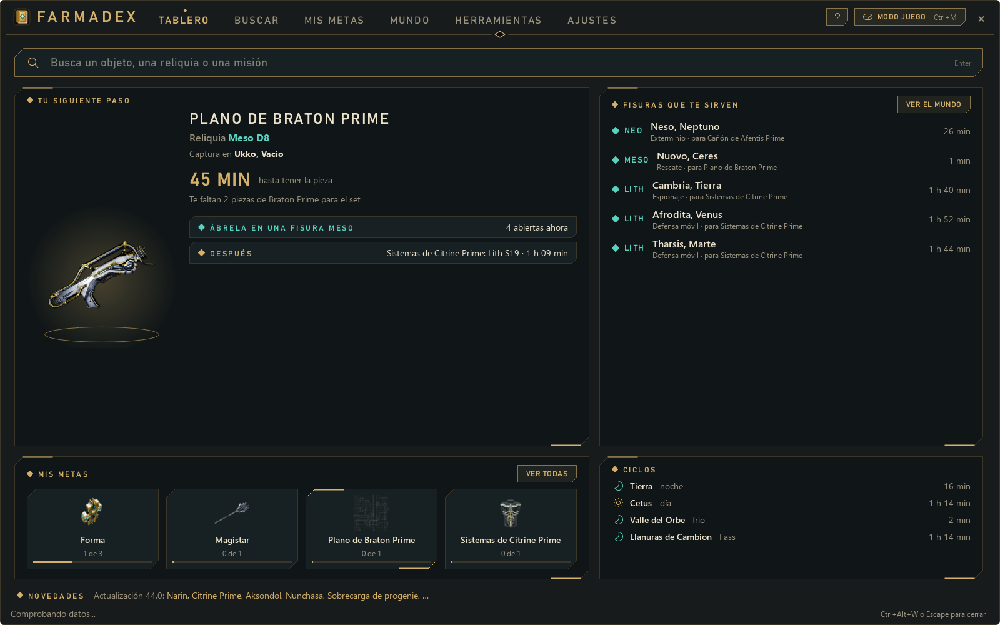

## Abres Farmadex y ya sabes qué hacer

Lo primero que ves ya no es una pantalla en blanco esperando a que escribas
algo: es el **Tablero**. Ahí tienes tu siguiente paso de verdad, la pieza más
rápida de conseguir de todo lo que llevas apuntado, con su reliquia, dónde
farmearla y en qué fisura de las que hay abiertas ahora mismo puedes abrirla.
Debajo, las fisuras que te sirven, un resumen de tus metas con su progreso, los
ciclos de Cetus, el Valle del Orbe y Cambion, y lo último que ha salido en el
juego.

Si no llevas nada apuntado todavía, el Tablero te lo dice claro y te lleva
directo al buscador. En cuanto marcas tu primer objetivo, empieza a decirte
qué hacer.

## Buscas algo y te dice adónde ir

Escribes «braton prime» y te sale la ficha con todo lo que hace falta: sus
estadísticas, su disposición de riven con los puntitos de siempre, y debajo,
de dónde sale cada pieza y en qué reliquias, con lo que vas a tardar en
conseguirlas. Los botones de arriba abren la wiki, YouTube o sus builds en
Overframe sin salir de Farmadex.

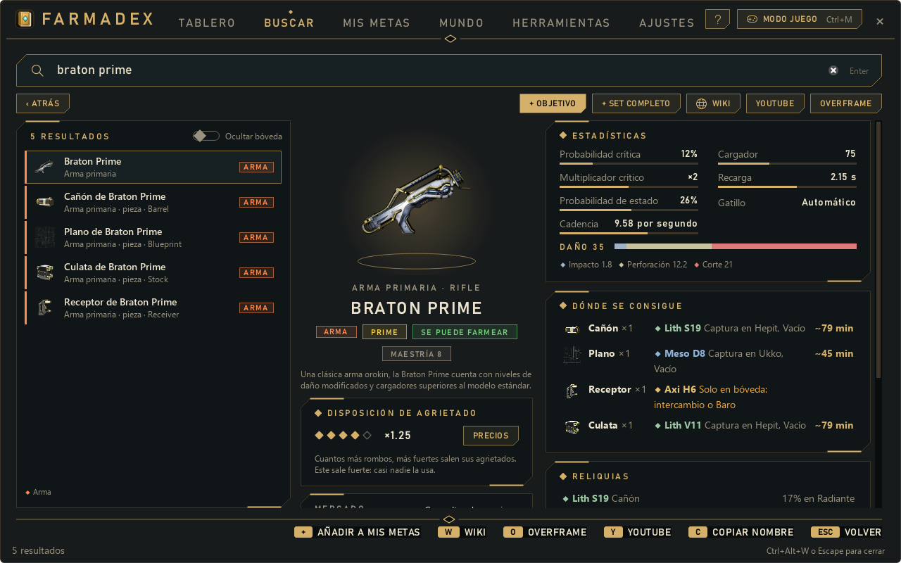

Lo importante sigue siendo el orden: no va por probabilidad, va por lo que
vas a tardar de verdad. Una rotación con buena pinta sobre el papel puede ser
una hora de partida; un jefe que suelta la pieza casi siempre, mucho menos.
Entiende erratas, nombres en inglés y cosas como «chasis de mesa prime» o «el
plano del rhino».

## Una ficha de Prime cuenta toda la historia

Si buscas una pieza Prime, la ficha no se queda en «dónde sale»: te dice qué
reliquia la lleva, en qué paso vas (conseguir la reliquia, abrirla en una
fisura, elegir la pieza), si esa reliquia está en bóveda y cuánto piden por
la pieza y por el set entero en warframe.market, todo en un único sitio.

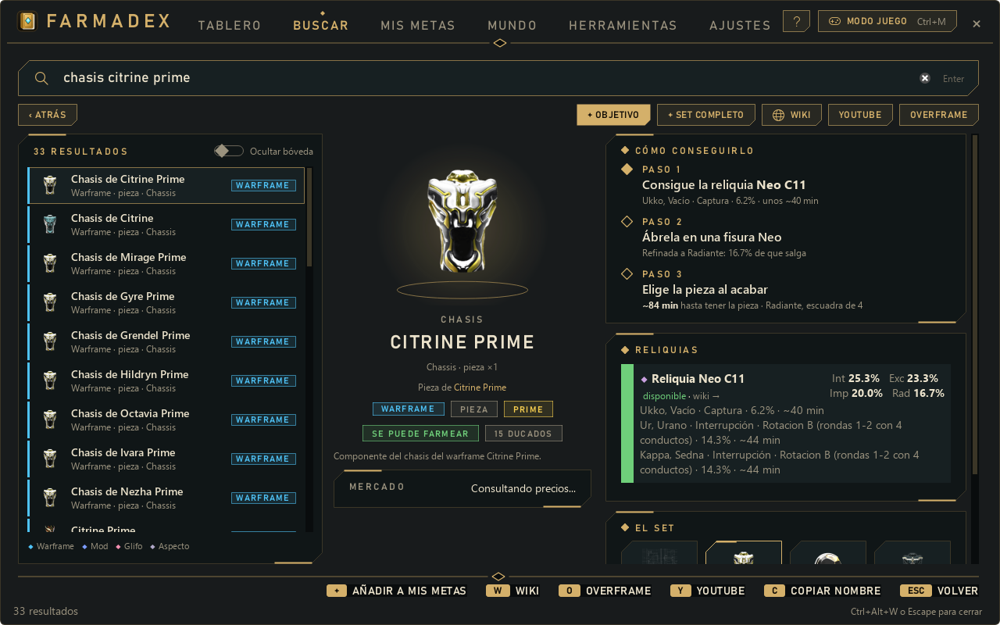

## Cada cosa con su color

Busca «sierra» y te salen el mod Sierra, un aspecto con «sierra» en el
nombre y algún objeto más. Antes tenías que leer cada línea para saber qué
era cada cosa; ahora cada tipo lleva su color (armas, mods, warframes,
recursos...) con su leyenda debajo de la lista, pensado sobre todo para quien
empieza y todavía no sabe si algo es un mod o un arma.

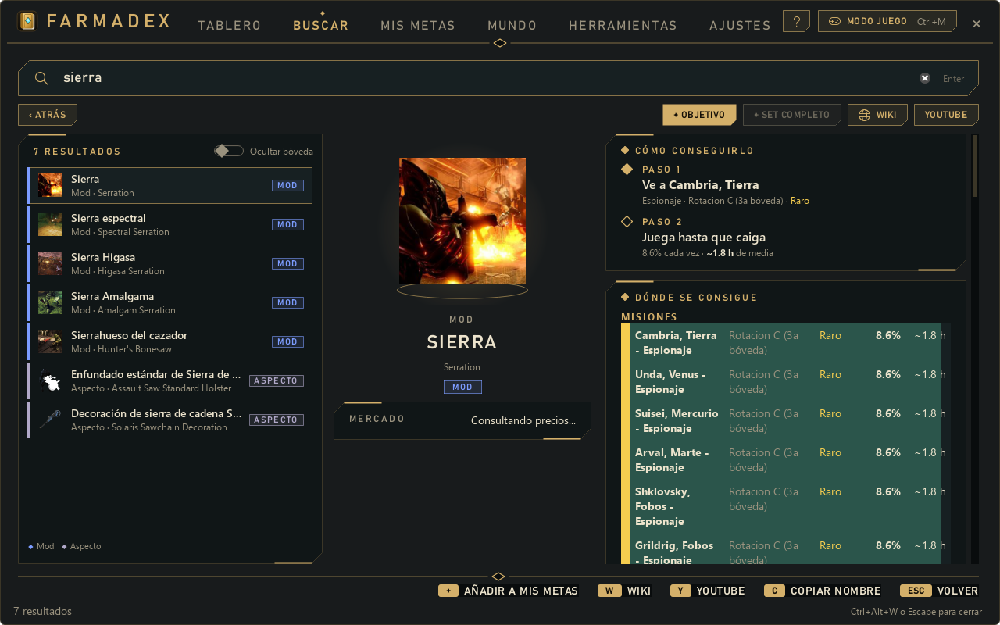

## Y cuándo cae, sin tener que mirar la wiki

Lo que más me hacía salir del juego no era saber la misión, era saber
*cuándo*: ¿esto es rotación B?, ¿y eso cuántas oleadas de Defensa son?
Busca una misión por su nombre («Hidrón») o por su tipo («defensa»,
«interrupción») y la ficha te lo explica: qué hay que hacer, en qué rotación
sale cada recompensa y, si tiene truco como la Interrupción, la tabla de
rondas y conductos.

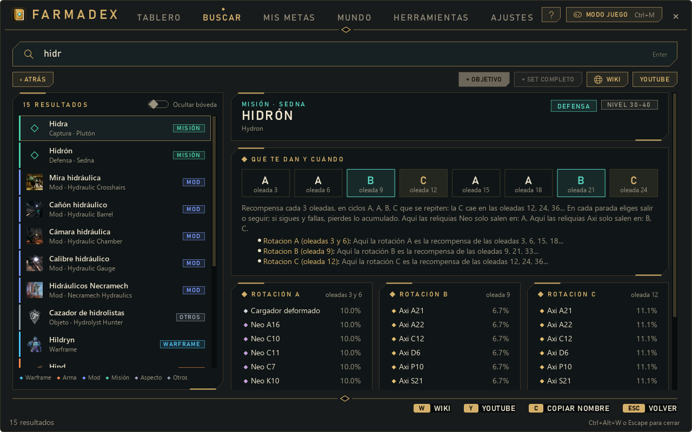

Bajando en la misma ficha tienes el detalle de cada rotación y, si lo que
buscas no está ahí, el enlace a la wiki y a guías en YouTube para leer más.

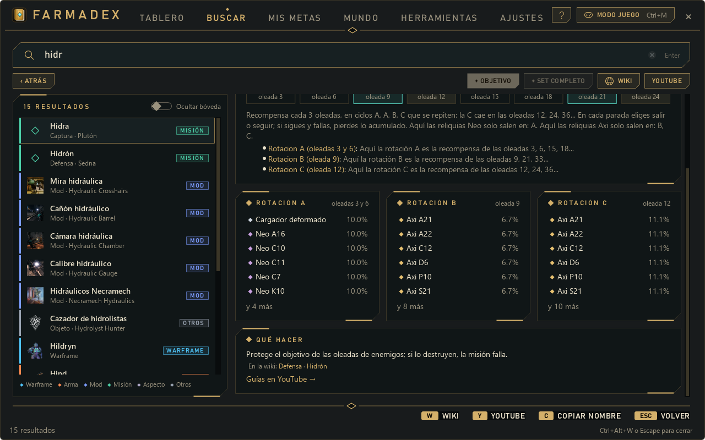

## Pregúntale como hablas

No hace falta escribir el nombre exacto. Puedes preguntar por un nodo
(«hepit»), por una pieza a medio escribir o directamente por «el último
warframe» para ver lo que ha traído la última actualización. Con el buscador
vacío, arriba tienes siempre una línea con las novedades, para que lo recién
salido no se te pase.

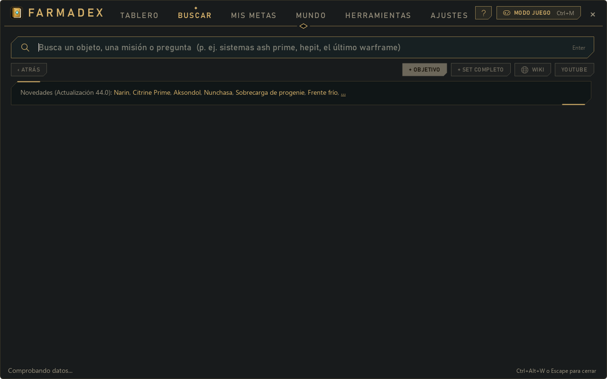

## Mis metas: tu lista de farmeo, ordenada

**Mis metas** junta en una sola pestaña, con sub-pestañas, lo que llevas
apuntado (Objetivos), tus Primes (Primes) y lo que ya tienes dominado
(Perfil).

En Objetivos apuntas lo que estás farmeando y cada cosa te dice la mejor
forma de conseguirla ahora mismo, con un aviso de **«para esto te sirve
hoy»**: qué fisuras abiertas en este momento te dan justo lo que necesitas.
Si abres una reliquia en solitario, lo que te toca se descuenta solo.

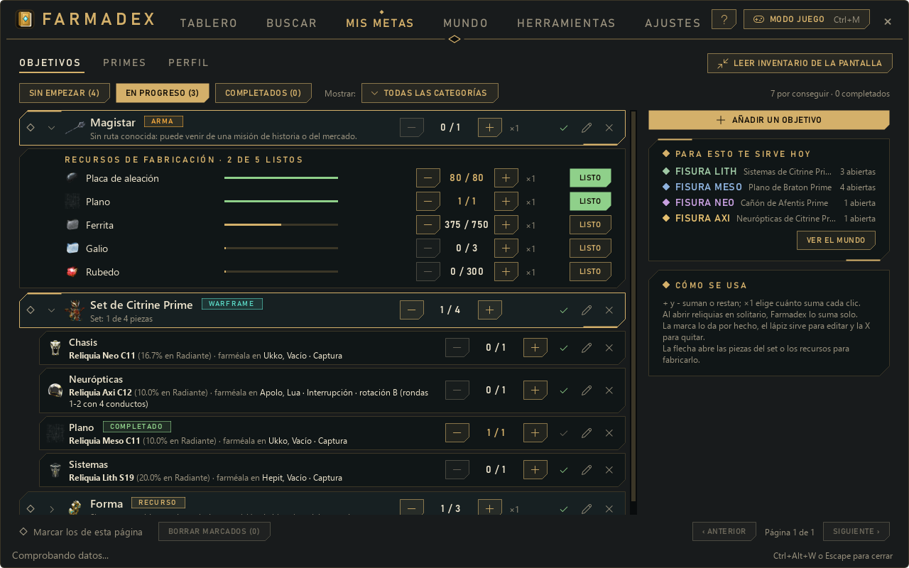

- **Cuántos quieres, de verdad.** Si quieres farmear quinientas de Criótica,
  pones quinientas, y puedes sumar de golpe lo que has sacado en una partida
  en vez de ir de uno en uno.
- **Sin empezar, En progreso y Completados**, en pestañas. Lo terminado no
  desaparece, por si quieres corregirlo.
- **Un set es un solo panel**: lo abres con un clic y dentro están sus
  piezas; un arma con receta puedes marcarla entera o abrir sus recursos y
  apuntar cada uno por separado.
- **Nada se borra sin querer**: antes de quitar algo te pregunta, y si
  quieres limpiar la lista puedes marcar varios y borrarlos juntos.

En Primes tienes una caja por cada set, al estilo del Relicario de
wf.xuerian.net: marcas lo que te falta y Farmadex te dice qué reliquias lo
llevan y dónde conseguirlas antes.

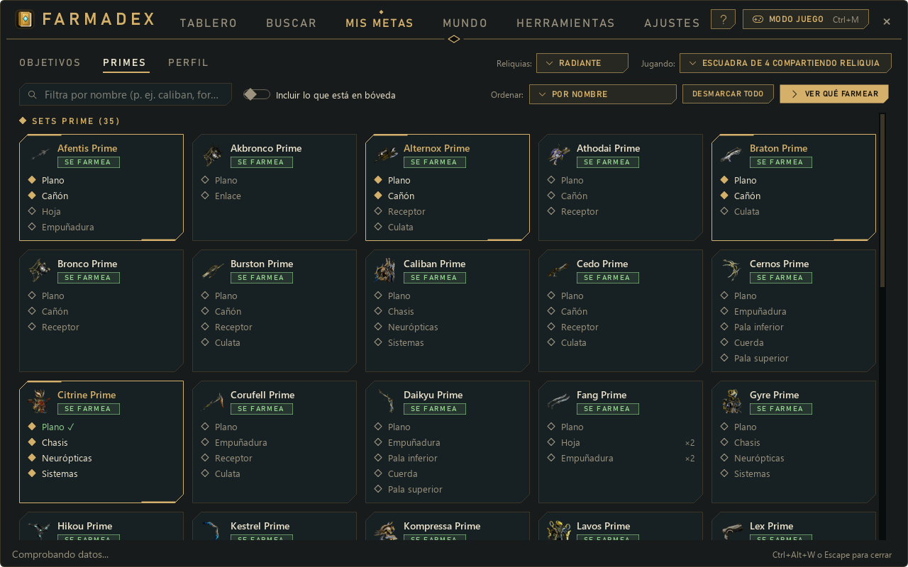

Arriba eliges el refinamiento de tus reliquias y si vas solo o en escuadra, y
el orden se ajusta solo. Las reliquias en bóveda se enseñan pero no cuentan
para lo que se puede farmear todavía.

## Al abrir una reliquia, cuál coger

Cuando sale la pantalla de recompensas de una fisura, Farmadex pone debajo de
cada tarjeta lo que necesitas para decidir: cuánto platino vale, cuántos
ducados da, si está en bóveda, si te sirve para algo que estés farmeando y si
ya la tienes. La mejor lleva la etiqueta «TE FALTA» o «MEJOR OPCIÓN» y el
borde dorado, y el resto se apaga un poco para que no distraiga. No hay que
pulsar nada y aparece al momento.

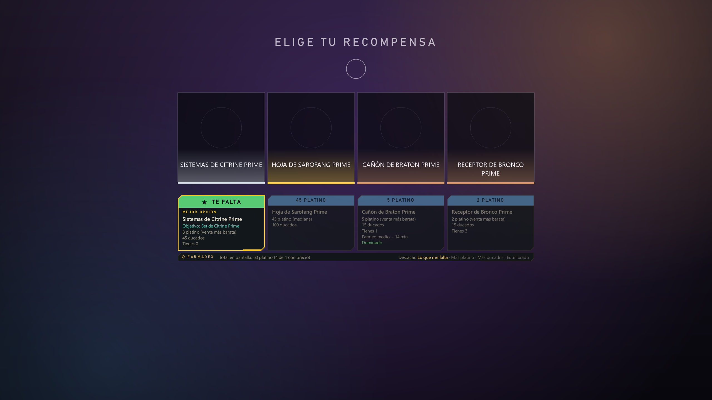

Lo que se considera «mejor» lo eliges tú en Ajustes: lo que te falta para tus
Primes, más platino, más ducados o un equilibrio entre todo. El panel es
ahora más grande y se lee mejor si juegas en una pantalla grande.

## Mundo: lo que hay ahora, y que te avise

Mundo va ahora por sub-pestañas: **Todo**, **Fisuras**, **Baro y Teshin** e
**Invasiones y alertas**. Arriba del todo te dice qué fisuras abiertas te
sirven para lo que tienes apuntado, y lo que está a punto de acabar sale
resaltado. Cada facción lleva su color, y si pulsas una recompensa se abre su
ficha. El panel de Teshin, nuevo, te dice qué trae el Camino de Acero esta
semana.

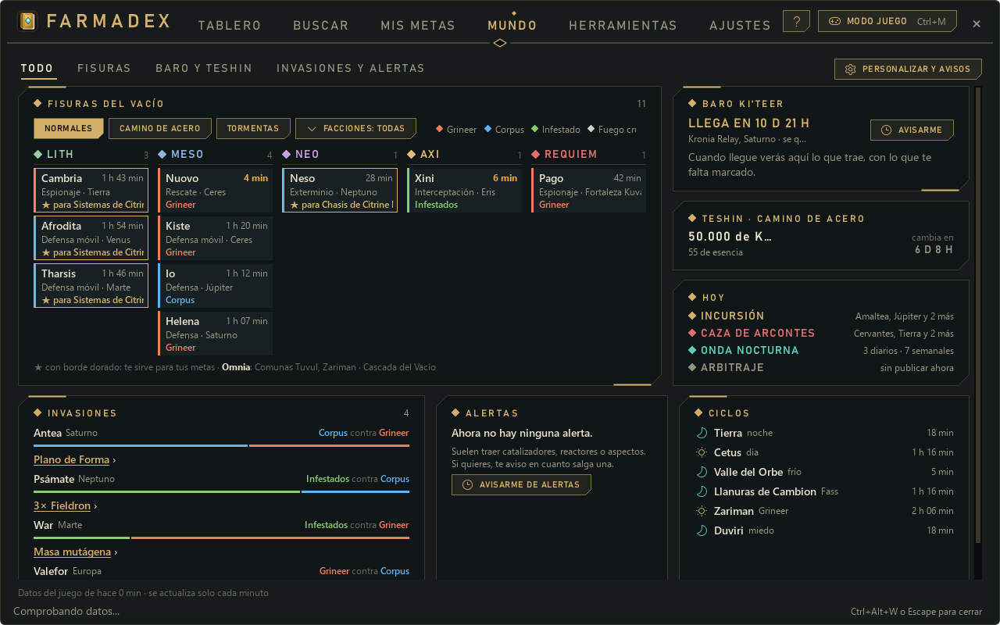

Pero lo mejor es que ya no tienes que ir a mirarlo. En **Personalizar y
avisos** eliges qué te interesa y Windows te avisa aunque tengas la ventana
escondida: «ha llegado Baro», «Baro trae algo que tienes en tus objetivos»,
«hay una fisura Axi de Supervivencia», «esta semana Teshin tiene Forma
Umbra»... Todo viene apagado y cada aviso sale una sola vez.

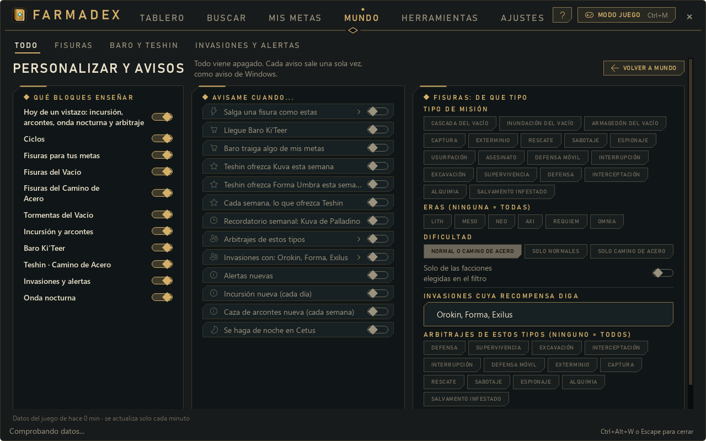

## Build: los mods de una build, con un atajo

¿Estás viendo la build de alguien y no sabes de dónde sale medio mod? Abre en
el juego la pantalla de mejoras de ese warframe o esa arma y pulsa
`Ctrl+Alt+B`. Farmadex lee los mods y los arcanos que se ven, te los lista y
al pulsar uno te abre su ficha con dónde conseguirlo. Lo que no reconoce con
seguridad lo pone aparte, sin inventárselo, y desde ahí mismo puedes abrir
sus builds en Overframe.

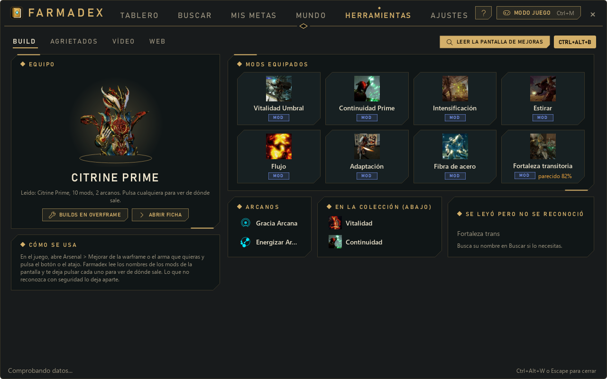

## Agrietados: ¿es bueno este riven?

Te ha salido un mod agrietado y no sabes si es una joya o para disolver. Pon
el ratón encima de la tarjeta en el juego y pulsa `Ctrl+Alt+G`, o apunta las
estadísticas a mano. Farmadex te dice, para cada una, entre qué valores puede
salir en esa arma y qué nota tiene la tuya, de S (lo mejor) a F, con un
veredicto en una frase y una referencia de precio de warframe.market.

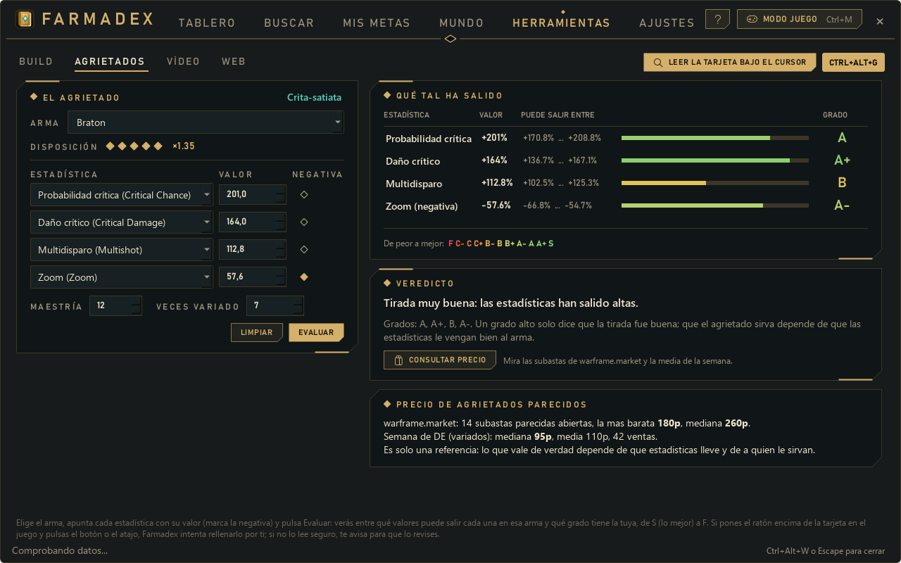

## Para jugar: Modo juego

`Ctrl+M` cambia a **Modo juego**: unas tarjetas flotantes con tu siguiente
pieza y una fisura que te sirve, encima del juego, que apenas ocupan sitio. Y
si necesitas mirar algo más, el buscador rápido se despliega desde ahí mismo
y con la chincheta **Fijar** se queda siempre encima, para consultarlo sin
cambiar de ventana.

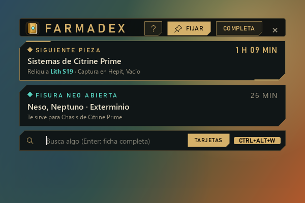

## A tu gusto

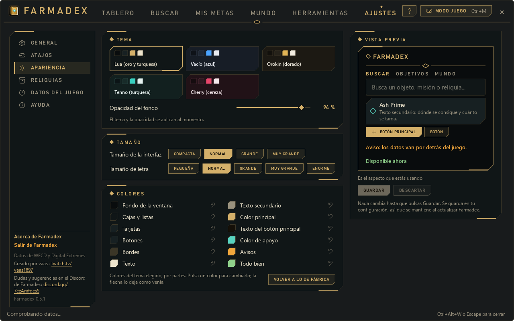

La primera vez que abras Farmadex viene con el tema nuevo, **Lua**, dorado y
turquesa; si ya lo tenías instalado y usabas otro tema, sigues con el tuyo,
no cambia solo. En Apariencia puedes hacer la ventana y la letra más grandes
(o más pequeñas), elegir entre Lua, Vacío, Orokin, Tenno o Cherry, y cambiar
cualquier color a tu gusto. Lo ves antes en la vista previa, y no se aplica
hasta que pulsas Guardar. Si te lías, «Volver a lo de fábrica» lo deja como
estaba.

## La primera vez

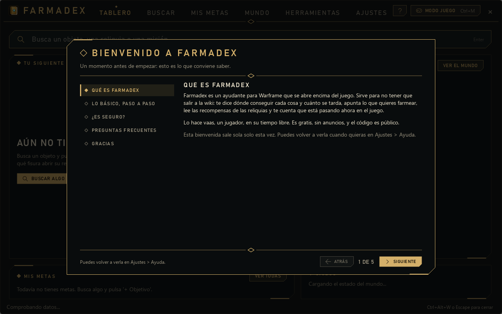

Al abrirlo por primera vez te recibe una bienvenida que te cuenta qué es
Farmadex, lo básico para empezar, si es seguro y las dudas más típicas.
Después te ofrece un recorrido por la ventana que te señala cada parte en su
sitio, también las nuevas: el Tablero, Mis metas, Mundo, Herramientas y Modo
juego. Las dos se pueden volver a ver cuando quieras desde Ajustes > Ayuda o
con el botón «Guía».

## Lo demás

- **Perfil.** Si abres Perfil > Equipamiento en el juego, Farmadex apunta lo
  que ya tienes dominado, y a partir de ahí te lo recuerda en las fichas y en
  las recompensas.
- **`Ctrl+Alt+Q`** lee el nombre que tengas bajo el cursor (inventario,
  mercado, donde sea) y te abre su ficha.
- **Los glifos de creadores de contenido** traen su código de canje y un
  botón para copiarlo, listo para pegar en el Mercado del juego.
- **Glosario.** Palabras como «rotación», «refinamiento» o «bóveda» salen
  subrayadas; pasas el ratón y te lo explica en una línea. Pensado para quien
  empieza.
- **Misiones explicadas al pasar el ratón.** Pasas el ratón por
  «Supervivencia», «Defensa» o «Interrupción» y te dice qué hay que hacer y
  cómo van sus recompensas, estés en la pestaña que estés.
- **El lector de pantalla se adapta a tu equipo.** Si notas el PC cargado
  (jugando y con OBS abierto, por ejemplo), Farmadex usa menos procesador
  para leer la pantalla del juego, para no ir a peor mientras juegas. Se
  puede dejar fijo en Ajustes > Avanzado.
- **Una ventana de verdad.** La mueves y le cambias el tamaño arrastrando
  desde cualquier borde, como cualquier programa. Y si le das otra vez al
  acceso directo con Farmadex ya abierto, te saca el que ya tenías en vez de
  abrir otro.
- **Si al abrir una reliquia no sale nada.** En Ajustes hay un «Diagnóstico
  de reliquias» que comprueba paso a paso si Farmadex ve el juego y te dice
  qué falla. Si no das con ello, te guarda un informe para mandármelo, sin
  nada de tu cuenta.
- **Idiomas y colores.** Español, inglés, francés, alemán y portugués, y
  cinco temas de color: Lua, Vacío, Orokin, Tenno y Cherry, que puedes
  retocar a tu gusto.
- **Se actualiza solo.** Baja la versión nueva por detrás y se instala cuando
  cierras Farmadex, nunca en mitad de una partida. La versión vieja se cierra
  del todo y no deja restos. Se puede desactivar.

## Descargar e instalar

1. Baja el instalador de la
   [última versión](https://github.com/angelsanchez97/farmadex/releases/latest)
   (o el `.zip` portable si no quieres instalar nada).
2. Ábrelo. Windows seguramente te enseñe un aviso azul; más abajo te explico
   por qué y qué hacer. No pide permisos de administrador.
3. La primera vez descarga los datos del juego y tarda un poco. Al pasar a
   una versión nueva a veces los vuelve a preparar una vez; es normal.

Warframe tiene que estar en **ventana** o **ventana sin bordes**; en pantalla
completa ningún programa puede dibujar encima. Se cambia en Opciones >
Pantalla.

Atajos, qué hace cada pestaña, problemas frecuentes y cómo desinstalar: en el
[manual](docs/MANUAL.md) y la [guía de instalación](docs/INSTALACION.md).

## Windows dice que puede ser peligroso

Es normal y tiene explicación. Al abrir el instalador, Windows enseña un
aviso azul que dice «Windows protegió tu PC». Es **SmartScreen**, y sale con
los programas nuevos que no llevan una firma digital de pago. Farmadex no la
lleva porque es gratis, lo hago yo solo y ese certificado cuesta bastante
dinero cada año.

El aviso no quiere decir que tenga un virus, solo que Windows todavía no
conoce el programa. Para seguir:

1. Pulsa **«Más información»**.
2. Pulsa **«Ejecutar de todas formas»**.

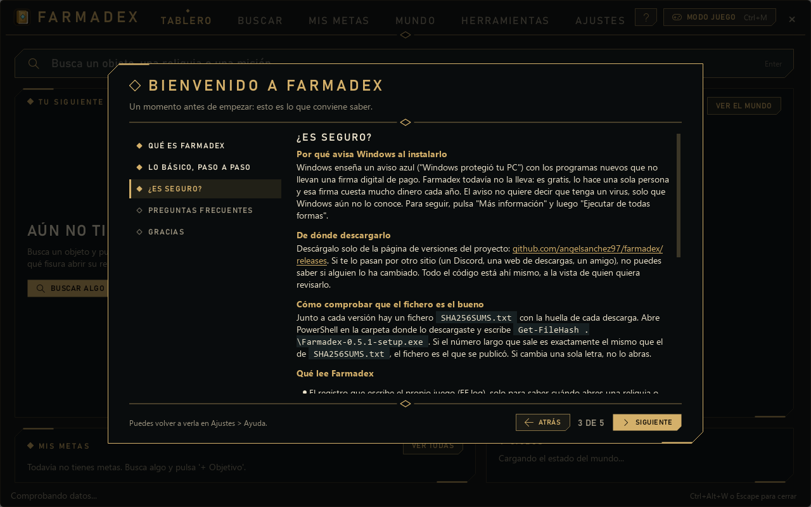

Si quieres quedarte tranquilo del todo:

- **Descárgalo solo de aquí**, de la
  [página de versiones de GitHub](https://github.com/angelsanchez97/farmadex/releases).
  Si te lo pasan por un Discord o una web de descargas, no puedes saber si
  alguien lo ha tocado.
- **Comprueba que el fichero es el bueno.** Junto a cada versión hay un
  `SHA256SUMS.txt` con la «huella» de cada descarga. Si la de tu fichero
  coincide, es exactamente el que yo subí.
- **Todo el código está a la vista** en este mismo repositorio.

En [¿Es seguro Farmadex?](docs/SEGURIDAD.md) tienes todo esto paso a paso,
con cómo sacar la huella en tu ordenador, qué lee el programa, qué guarda y
qué no toca. Lo mismo está resumido dentro de la app, en la bienvenida y en
Ajustes > Acerca de Farmadex.

## Farmadex y Digital Extremes

Farmadex no toca el juego: no lee ni escribe su memoria, no modifica sus
ficheros, no inyecta nada, no pulsa teclas por ti y no entra en tu cuenta.
Solo mira la pantalla y el registro que escribe el propio juego (`EE.log`),
igual que llevan años haciendo WFInfo y AlecaFrame. Hasta donde sabemos, no
incumple el EULA.

Aun así, DE no da garantías a ningún programa de terceros, así que la
decisión de usarlo es tuya. Esto es lo que me contestó su soporte cuando les
pregunté:

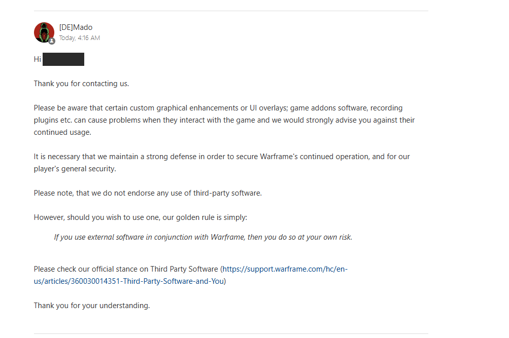

Su postura oficial está en
[Third Party Software and You](https://support.warframe.com/hc/en-us/articles/360030014351-Third-Party-Software-and-You),
y dentro del programa la tienes en Ajustes > Acerca de Farmadex.

Farmadex no está afiliado a Digital Extremes ni tiene su respaldo. Warframe y
todo su contenido son de Digital Extremes.

Sobre tus datos: `EE.log` contiene tu correo y tu IP, pero de ese fichero
solo se buscan unos pocos mensajes del juego y nada sale de tu ordenador. Las
capturas de pantalla se leen en tu equipo y no se guardan. Más detalle en
[¿Es seguro Farmadex?](docs/SEGURIDAD.md).

## Sobre el proyecto

Lo he hecho yo, jugando, para mí y para quien le sirva, con ayuda de Claude,
que ha escrito buena parte del código conmigo. Mucho de lo nuevo sale de los
comentarios de quienes lo prueban, así que si algo falla o echas algo en
falta, abre un [issue](https://github.com/angelsanchez97/farmadex/issues),
pásate por el [Discord de Farmadex](https://discord.gg/7ezAmfqesS) o por el
chat de [mi canal](https://www.twitch.tv/vaas1897).

Para compilarlo o trastear con el código, mira el final de la
[guía de instalación](docs/INSTALACION.md).

## Datos y licencias

Los datos del juego salen de proyectos abiertos:

- [WFCD/warframe-items](https://github.com/WFCD/warframe-items): catálogo de
  objetos, estadísticas y traducciones (MIT).
- [WFCD/warframe-drop-data](https://github.com/WFCD/warframe-drop-data):
  tablas de drops oficiales de Digital Extremes (MIT).
- [warframestat.us](https://docs.warframestat.us/): estado del mundo
  (Apache-2.0).
- [warframe.market](https://warframe.market/): precios en platino, también
  los de los rivens.
- [Wiki oficial de Warframe](https://wiki.warframe.com/): códigos de los
  glifos.
- Public Export de Digital Extremes: nombres del mapa en español y estado del
  mundo cuando la API de la comunidad falla.
- Digital Extremes también publica cada semana lo que se ha pagado por los
  rivens de cada arma; Farmadex lo usa como segunda referencia de precio.

Bibliotecas que lleva dentro: PySide6 / Qt for Python (LGPL-3.0, enlazada
dinámicamente y sin modificar), RapidOCR y ONNX Runtime (Apache-2.0), httpx
(BSD-3), RapidFuzz (MIT), mss (MIT) y OpenCV (Apache-2.0).
