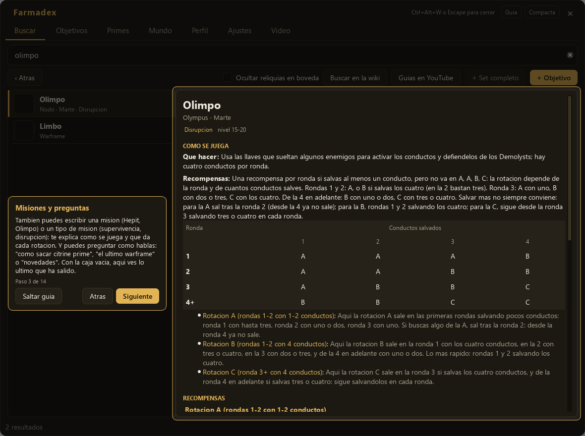
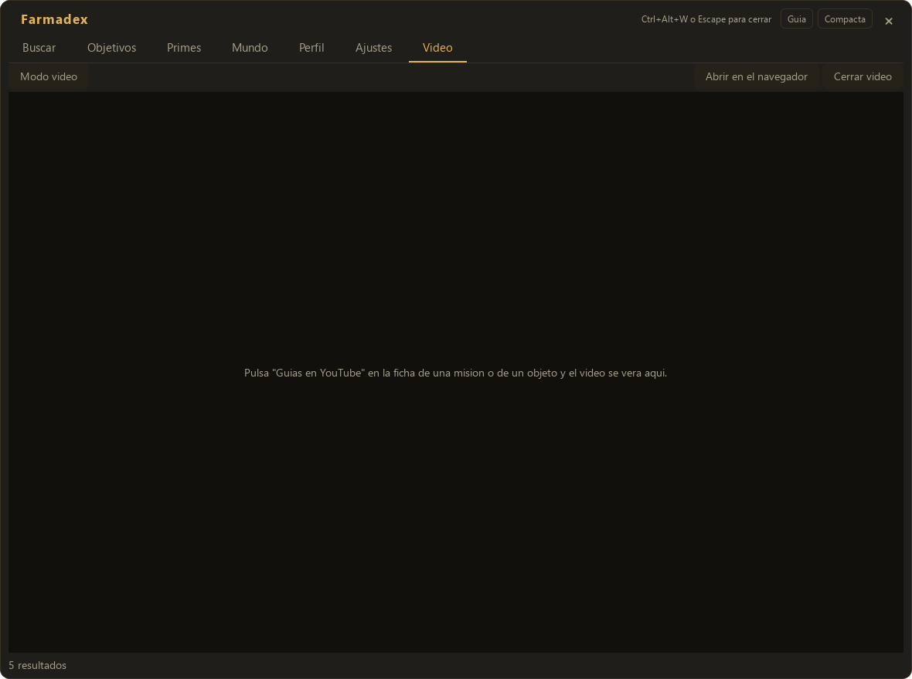

# Manual de usuario de Farmadex

Farmadex es un overlay para Warframe: una ventana que se abre encima del juego
con un atajo de teclado. Le escribes el nombre de cualquier objeto, pieza, mod
o reliquia y te dice de dónde sale, sin que tengas que salir de la partida ni
pelearte con el códice del juego, que solo cuenta la mitad de lo que hace
falta saber.

No es un programa que juegue por ti ni que toque el juego: solo lee lo que tú
le escribes y, si se lo pides, lo que hay en la pantalla.

## Lo que hace falta para usarlo

- Warframe en **«Ventana sin bordes»** (o en DX12 con ventana). En **pantalla
  completa exclusiva** ningún overlay se puede dibujar encima del juego, ni
  este ni ningún otro programa: es una limitación de Windows, no de Farmadex.
  Se cambia en el juego, en Opciones > Pantalla.
- Conexión a internet la primera vez que se abre (descarga los datos del
  juego) y mientras se usa, para el estado del mundo y los precios.

## La primera vez que se abre

Al abrir Farmadex por primera vez descarga los datos del juego: el catálogo
de objetos y las tablas de dónde cae cada cosa. Se ve una barra de progreso y
tarda unos minutos. Mientras tanto la pestaña Buscar está desactivada; el
resto de la ventana ya se puede usar.

Farmadex vive en la bandeja del sistema, al lado del reloj de Windows. El
icono de la bandeja tiene un menú con «Mostrar», «Ajustes», «Actualizar
datos» y «Salir»; un clic normal sobre el icono abre y cierra la ventana.

En cuanto la ventana está lista, la primera vez se abre sola una guía de uso
corta que resalta cada parte de la interfaz: la búsqueda, las misiones y las
preguntas, los botones de la wiki y de YouTube, Objetivos, Primes, Mundo, la
pestaña Vídeo, las recompensas de reliquia, Perfil, el modo compacto, Ajustes
y qué hacer si al abrir una reliquia no sale nada. Se puede saltar en
cualquier momento con el botón «Saltar guía» o con Escape.

 El botón **«Guía»**, en la
cabecera de la ventana, la vuelve a lanzar desde el principio cuando quieras.

## Las pestañas

### Buscar

Escribe cualquier cosa del juego: un objeto, una pieza, un recurso, un mod o
una reliquia, en español o en inglés, y aunque lo escribas con alguna errata.
La lista de la izquierda va enseñando lo que coincide; a la derecha, la ficha
completa de lo que tengas seleccionado.

Ejemplo: quieres saber de dónde sale la **Criótica**. Escribes «criotica» y
en la ficha aparece el recurso, en qué misiones cae y con qué probabilidad, y
un bloque **«Por dónde empezar»** con el sitio más rápido para conseguirlo
hoy.

Si lo que buscas es una pieza de un Prime (por ejemplo, «sistemas de ash
prime»), la ficha además enseña:

- En qué reliquias cae esa pieza, con la probabilidad según el refinamiento
  de la reliquia (Intacta, Excepcional, Impecable, Radiante) y si esa
  reliquia está **en bóveda** (ya no se puede farmear, solo comprarla a otro
  jugador) o disponible. Farmadex lo decide mirando las tablas oficiales de
  drops: si una reliquia todavía cae en alguna misión, no está en bóveda. Por
  eso una reliquia recién salida no aparece como «en bóveda» aunque otras
  fuentes lo digan, y todas las pestañas (Buscar, Primes, Objetivos, las
  recompensas) coinciden.
- En qué misiones cae cada una de esas reliquias, con el planeta, el nodo y
  el tipo de misión en español.
- El precio en platino de warframe.market, si el objeto se puede vender.

La casilla **«Ocultar reliquias en bóveda»** quita de la ficha las reliquias
que ya no se pueden conseguir jugando, para no liar la lista con opciones que
solo sirven si vas a comprarlas.

Con los botones **«+ Objetivo»** y **«+ Set completo»** añades lo que estás
viendo (o todas sus piezas de una vez) a la pestaña Objetivos.

Si la búsqueda no encuentra nada, Farmadex lo dice y sugiere lo más parecido
en vez de dejar la ficha anterior pintada, que podría confundirse con la
respuesta a lo que acabas de escribir.

#### Rotaciones a la vista

En la lista de misiones de una ficha, cada fila dice al lado **cuándo** cae el
objeto en esa misión, para que no tengas que ir a la wiki a mirar qué era la
rotación C:

- En Supervivencia y demás misiones por tiempo, el minuto en que sale esa
  rotación, por ejemplo «Rotación C (min 20)».
- En Defensa, Intercepción o Excavación, tras qué oleadas, rondas o
  excavadoras completadas.
- En Disrupción, en qué rondas y con cuántos conductos salvados, porque ahí la
  rotación no va en orden A, A, B, C como en las demás.
- En Espionaje, qué bóveda: la primera, la segunda o la tercera que saques.

El nombre de cada nodo es un enlace a su página de la wiki oficial, y al
final de la sección hay una línea **«En la wiki:»** con los tipos de misión y
los nodos de esas filas. Se abren en el navegador solo si pulsas.

#### Buscar una misión

Además de objetos, puedes escribir el nombre de un **nodo** («Olimpo»,
«Hepit», «Ukko») o de un **tipo de misión** («supervivencia», «defensa»,
«disrupción»). La ficha de un nodo enseña:

- El planeta, el tipo de misión y el nivel de los enemigos.
- **Cómo se juega**: qué hay que hacer y cómo van sus recompensas, en dos
  frases. En la Disrupción añade la tabla de rondas y conductos salvados que
  decide qué rotación te toca, y una explicación de cuándo sale cada letra.
- **Recompensas**: lo que suelta cada rotación, con su probabilidad. Pulsando
  un objeto se abre su ficha.

La ficha de un tipo de misión explica cómo se juega, cuándo cae cada rotación
y la lista de nodos de ese tipo; pulsando uno se abre su ficha.

Si pasas el ratón por el tipo de misión en cualquier sitio de Farmadex (en
una ficha, en Primes, en Objetivos o en las fisuras de Mundo) sale la misma
explicación corta.

#### Preguntas y novedades

No hace falta escribir el nombre exacto: puedes preguntar como lo dirías.
«Cómo sacar citrine prime», «dónde consigo el chasis de rhino» o «where to
farm forma» buscan lo que importa y quitan el resto.

Las preguntas por lo nuevo también funcionan: **«el último warframe»**, «el
último prime», **«novedades»** o «lo nuevo». Farmadex enseña lo que salió en la
última actualización del juego; si es un solo warframe, abre directamente su
ficha, con una nota debajo de lo demás que salió a la vez.

Con el buscador vacío, la ficha enseña una línea **«Novedades»** con los
objetos de la última actualización; pulsando uno se abre su ficha.

#### Wiki y guías en YouTube

Encima de la ficha hay dos botones:

- **«Buscar en la wiki»** abre en el navegador la página de la wiki oficial
  de Warframe del objeto abierto (o, si no hay ficha abierta, la búsqueda de
  lo que hayas escrito). Sirve para lo que Farmadex no cuenta: habilidades,
  cómo se construye, historia.
- **«Guías en YouTube»** busca vídeos de la misión o del objeto abierto,
  ordenados por los más vistos, y los abre en la pestaña **Vídeo** de
  Farmadex (más abajo). Farmadex no descarga nada de YouTube: solo abre la
  búsqueda para que elijas el vídeo.

### Objetivos

Aquí apuntas lo que estás farmeando. Cada objetivo enseña una barra de
progreso (que subes y bajas a mano con los botones **-** y **+**) y la mejor
ruta conocida para conseguirlo ahora mismo: la reliquia, dónde cae y con qué
probabilidad, o el sitio directo si el objeto no sale de reliquias.

Ejemplo: quieres construir una Forma. La añades desde Buscar y en Objetivos
verás algo como «Reliquia Axi A22 (20.0% en Radiante) · farméala en Cerberus,
Plutón · Intercepción · rotación B». Si en vez de una pieza sueltas añades un
Prime entero con **«+ Set completo»**, se crea un objetivo por cada pieza que
le falte.

### Primes

Una caja por cada Prime del juego, con una casilla por pieza. Marca las piezas
que te faltan y pulsa **«Dónde farmear»**: sale la lista de reliquias que las
llevan y la mejor misión para conseguir cada una, ordenada por el tiempo medio
hasta tener la pieza en la mano (conseguir la reliquia y abrirla en fisuras,
todo junto). **«Piezas»** vuelve a la rejilla.

- Arriba a la derecha eliges el **refinamiento** con el que abres las
  reliquias (de Intacta a Radiante) y si juegas **solo** o en **escuadra de 4
  compartiendo reliquia**; el orden se recalcula.
- **«Filtra por nombre»** deja en la rejilla solo lo que escribas
  («caliban», «forma»).
- **«Incluir lo que está en bóveda»** enseña también las piezas que ya no se
  pueden farmear; por defecto se ocultan. En el resultado, las reliquias en
  bóveda se enseñan pero no cuentan para el orden.
- **«Desmarcar todo»** limpia la rejilla.

Marcar una pieza aquí es lo mismo que añadirla a Objetivos, y al revés.

### Mundo

Qué hacer ahora mismo: fisuras del Vacío abiertas, filtrables por era (Lith,
Meso, Neo, Axi, Requiem, Omnia) y por modo (Normal, Camino de Acero, Tormenta
del Vacío), con cuenta atrás en vivo. También los ciclos de Cetus, el Valle
del Orbe y Cambion, invasiones, alertas, arbitración, la incursión del día,
caza de arcontes, Nightwave, y Baro Ki'Teer con su inventario.

Si tienes objetivos pendientes en la pestaña Objetivos, un bloque **«Para tus
objetivos»** arriba del todo marca qué fisuras abiertas sirven para lo que
estás farmeando, con las dos más rápidas de cada era que hace falta. Lo que
caduca en menos de diez minutos se pinta en naranja.

Ejemplo: te falta una reliquia Neo para completar un objetivo. En Mundo, con
el filtro puesto en «Neo», ves todas las fisuras Neo abiertas ahora mismo
ordenadas por rapidez de misión, y arriba, marcada, la que además sirve para
tu objetivo.

Hay dos disposiciones a elegir en Ajustes: **Lista** (una columna, todo por
orden de prioridad) y **Tablero** (fisuras a la izquierda, el resto del día a
la derecha).

### Perfil

Sirve para saber qué te falta por dominar. Se importa con el botón
**«Importar perfil (JSON)...»**, que abre un fichero de perfil de Warframe.

Digital Extremes cerró en 2026 la descarga pública de perfiles desde
warframe.com, así que hoy la única forma de traer tus datos es tener ese
fichero JSON guardado de antes e importarlo a mano; Farmadex no pide nada a
Digital Extremes por su cuenta.

Una vez importado, la pestaña enseña tu rango de maestría, una tabla de
dominados / a medias / sin tocar por categoría, cuántos nodos del mapa
estelar (o del Camino de Acero, con la casilla de arriba) te faltan por
planeta, tus intrínsecos de Railjack y del Errante, tu reputación con cada
sindicato, y la lista de lo que te falta por dominar, agrupada por categoría.

Con el perfil importado, además, la ficha de cualquier objeto en Buscar y las
etiquetas que aparecen al leer una reliquia (más abajo) dicen si ya lo tienes
dominado, a medias o sin tocar.

### Vídeo

Aquí se ven las guías que abre el botón **«Guías en YouTube»** de una ficha,
dentro de la propia ventana de Farmadex. Mientras no hayas abierto ninguna, la
pestaña solo dice cómo hacerlo.

- **«Modo vídeo»** deja Farmadex reducido a solo el vídeo, sin pestañas,
  encima del juego: pensado para quien juega con un solo monitor y quiere ir
  siguiendo la guía mientras juega. El botón de la cabecera pasa a decir
  **«Salir del vídeo»** y te devuelve a la vista completa, con el vídeo
  todavía en su pestaña. El modo vídeo recuerda su propio tamaño y posición.
- Esconder Farmadex con el atajo no para el vídeo: se sigue oyendo, que en
  modo vídeo es justo lo útil. **«Cerrar vídeo»** lo para del todo.
- **«Abrir en el navegador»** lleva el mismo vídeo a tu navegador.

El reproductor usa WebView2, que ya viene con Windows 10 y 11. Si en tu equipo
no puede arrancar, la pestaña dice «No se puede reproducir aquí» con un botón
para abrir la guía en el navegador; nunca se abre nada solo. La sesión y la
caché del reproductor se guardan en la carpeta de datos de Farmadex, y se
borran con «Borrar datos del reproductor» en Ajustes.

### Ajustes

- **Atajos de teclado**: los tres atajos globales de Farmadex, editables.
  Escribe la combinación y pulsa «Aplicar atajos»; si la combinación no vale
  o ya la usa otro programa, se avisa antes de aplicarla.
- **Tema de color**: Vacío (azul), Orokin (dorado), Tenno (turquesa) o Cherry (cereza). Cambia
  al momento.
- **Idioma**: Automático (el de Windows, si está traducido) o uno fijo entre
  español, inglés, francés, alemán y portugués de Brasil. El menú de la
  bandeja del sistema no cambia de idioma al vuelo: hace falta reiniciar
  Farmadex para verlo también ahí.
- **Disposición de Mundo**: Lista o Tablero.
- **Opacidad del fondo**: lo transparente que se ve el juego a través de la
  ventana.
- **«Leer sola la pantalla de recompensas de reliquia»**: si está marcada (lo
  está por defecto), Farmadex detecta cuándo el juego abre esa pantalla y lee
  las recompensas sin que hagas nada; si la desmarcas, solo lee cuando pulsas
  el atajo.
- Debajo, un aviso con el modo de pantalla que Farmadex ha detectado en el
  juego (ventana, ventana sin bordes, pantalla completa exclusiva, o que el
  juego no está abierto).
- **Recompensas de reliquia**: si se enseñan como etiquetas pequeñas junto a
  cada tarjeta o como un panel debajo de las cuatro.
- **Ritmo de juego** (rápido, normal, tranquilo): ajusta todos los tiempos
  estimados de las fichas a cómo juegas tú. No cambia las probabilidades ni el
  orden de los sitios.
- **Datos del juego**: cuántos objetos tiene el catálogo, de cuándo son los
  datos, y tres botones: «Reconstruir el índice» (lo vuelve a montar desde
  cero), «Abrir la carpeta de datos» y «Borrar datos del reproductor» (cierra
  el vídeo y borra la sesión y la caché del reproductor de guías).
- **Versión**: la versión instalada, un botón «Comprobar ahora» y, si hay una
  más nueva, un enlace o un botón para instalarla. Farmadex nunca se instala
  nada a sí mismo sin que tú lo pidas.
- **Diagnóstico de reliquias**: para cuando al abrir una reliquia no sale nada
  encima del juego. «Comprobar la lectura de reliquias» revisa paso a paso si
  Farmadex ve el juego, su registro y la pantalla de recompensas, y te dice
  qué falla; «Guardar informe para enviar» deja un `.zip` para mandarlo a quien
  te ayude. Está explicado más abajo, en Problemas frecuentes.
- **«Salir de Farmadex»**, abajo del todo.

### Modo compacto

Con **Ctrl+M** (o el botón de la cabecera) la ventana pasa de la vista
completa a una cajita de 560×250 píxeles pensada para jugar o para un
directo sin tapar un tercio de la pantalla: solo la búsqueda y lo esencial
del resultado (nombre, etiquetas, dónde conseguirlo y precio). Con las
flechas arriba/abajo cambias de resultado y con **Enter** se abre la ficha
completa en modo normal. Cada modo recuerda su propia posición y tamaño en
pantalla.

### Glosario

Términos del juego como «reliquia», «era», «bóveda», «rotación»,
«refinamiento», «ducados» o «rareza» aparecen resaltados en toda la
aplicación; si no sabes qué significan, pasa el ratón por encima y sale una
explicación corta. Si ya los conoces, no estorban: no hay que hacer nada
para que desaparezcan.

Lo mismo pasa con los tipos de misión (Supervivencia, Defensa,
Disrupción...): al pasar el ratón te dice qué hay que hacer y cómo van sus
recompensas, y sobre una rotación, cuándo cae esa letra en esa misión.

## Atajos de teclado

| Atajo | Qué hace |
|---|---|
| `Ctrl+Alt+W` | Abre y cierra el overlay |
| `Ctrl+Alt+Q` | Lee lo que hay bajo el cursor y abre su ficha |
| `Ctrl+Alt+R` | Lee la pantalla de recompensas de reliquia |
| `Ctrl+M` | Cambia entre la vista completa y la compacta |
| `Escape` | Cierra el overlay |

Los tres primeros se pueden cambiar en Ajustes.

## Cómo funciona la lectura de pantalla

Farmadex puede leer texto de la pantalla del juego con dos atajos distintos.
Los dos necesitan que Warframe esté en **Ventana sin bordes** o en una
ventana normal (DX12); en pantalla completa exclusiva no hay pantalla que
leer porque tampoco hay overlay que dibujar encima.

- **`Ctrl+Alt+Q` (bajo el cursor)**: captura un recuadro alrededor del ratón,
  reconoce el texto que haya y, si encuentra algo del catálogo, abre su
  ficha. Sirve para preguntar «¿esto qué es?» sobre cualquier nombre que veas
  en un menú o en el inventario del juego.
- **`Ctrl+Alt+R` (recompensas de reliquia)**: lee las 1-4 recompensas de la
  pantalla que sale al abrir una reliquia y pinta encima de cada una una
  etiqueta con su nombre, sus ducados si los tiene, si está **en bóveda**, si
  cubre uno de tus objetivos pendientes, y tu estado de maestría si has
  importado tu perfil. Con la opción de Ajustes activada (lo está por
  defecto) esta lectura se dispara sola en cuanto el juego abre esa pantalla;
  las etiquetas se quedan doce segundos y desaparecen solas.

La lectura la hace un motor de OCR (RapidOCR por defecto, o el OCR de Windows
si lo eliges en Ajustes) que va empaquetado con la aplicación: no hace falta
instalar nada aparte, y no envía la imagen a ningún sitio. El texto leído se
compara contra el catálogo descargado; si no encuentra una coincidencia
suficientemente buena, no dice nada en vez de arriesgarse a equivocarse.

## Ejemplos de uso

- **«Quiero saber de dónde sale la Criótica»**: pestaña Buscar, escribe
  «criotica», mira el bloque «Por dónde empezar» de la ficha.
- **«Quiero saber cuál de las cuatro recompensas de la reliquia me
  interesa»**: abre la reliquia en el juego (con la opción automática de
  Ajustes no hace falta nada más, o pulsa `Ctrl+Alt+R`) y mira las etiquetas
  sobre cada recompensa: si alguna cubre uno de tus objetivos aparece
  marcada en verde, y si alguna está en bóveda se ve en naranja. Para
  comparar el valor en platino de las que no tengan esas marcas, abre cada
  una en la pestaña Buscar (o en el modo compacto) y mira el precio de
  warframe.market en su ficha.
- **«Voy a hacer Olimpo y no sé en qué ronda salir»**: escribe «olimpo» en
  Buscar. La ficha te explica la Disrupción, con la tabla de rondas y
  conductos, y qué reliquias da cada rotación.
- **«¿Qué ha salido en la última actualización?»**: escribe «novedades» o «el
  último warframe», o deja el buscador vacío y mira la línea de Novedades.
- **«Quiero ver una guía de esta misión y solo tengo un monitor»**: con la
  ficha de la misión abierta, pulsa «Guías en YouTube», elige el vídeo en la
  pestaña Vídeo y pulsa «Modo vídeo». Con el atajo de siempre escondes y
  sacas Farmadex sin que se pare el vídeo.
- **«Quiero saber si ya he dominado este arma»**: importa tu perfil en la
  pestaña Perfil una vez; a partir de ahí, la ficha de cualquier objeto en
  Buscar y las etiquetas de recompensas dicen si está dominado, a medias o
  sin tocar.

## Problemas frecuentes

**No se ve encima del juego.** Warframe tiene que estar en «Ventana sin
bordes» o en ventana con DX12; mira en Ajustes qué modo ha detectado
Farmadex. Si dice «pantalla completa exclusiva», cambia el modo de pantalla
del juego en Opciones > Pantalla, o mueve Farmadex a un segundo monitor si
tienes uno: en pantalla completa exclusiva el overlay se abre ahí solo. Si
abres una reliquia en ese modo, Farmadex te lo avisa con un globo desde la
bandeja, porque en ese momento la ventana está escondida y no verías nada.

**No sale nada al abrir una reliquia y no sé por qué.** En Ajustes, abajo del
todo, está «Diagnóstico de reliquias». Pulsa «Comprobar la lectura de
reliquias»: cada línea dice en claro si va bien o mal: si se ha encontrado
`EE.log` y se está leyendo (con su ruta), cuándo se vio la última pantalla de
recompensas y si se leyó y se pintó, en qué modo de pantalla va el juego, si
el lector de pantalla ha cargado, si la lectura automática está activada y
qué estilo de recompensas tienes. Lo mejor es hacerlo justo después de abrir
una reliquia que no ha salido. Si no sacas nada en claro, pulsa «Guardar
informe para enviar»: deja un `.zip` en el Escritorio con ese diagnóstico y el
registro de Farmadex, listo para mandarlo a quien te ayude. Ese informe no
lleva `EE.log` ni nada de tu cuenta.

**El atajo no responde.** Puede que otro programa (o el propio juego) ya use
esa combinación de teclas: Windows solo deja que un programa la reciba.
Prueba a cambiar el atajo en Ajustes; si la combinación no es válida o está
ocupada, el aviso lo dice al pulsar «Aplicar atajos».

**No reconoce las recompensas o lo que hay bajo el cursor.** Puede ser que el
motor de lectura no haya podido cargar (Ajustes muestra un aviso si es así;
prueba a cambiar entre RapidOCR y el OCR de Windows), que la pantalla de
recompensas todavía esté con la animación a medias (espera un segundo y
pulsa `Ctrl+Alt+R` otra vez), o que el juego haya cambiado esa pantalla en un
parche reciente.

**Los datos parecen viejos.** Tras un parche grande de Warframe, las fuentes
de datos (WFCD y las tablas oficiales de Digital Extremes) pueden tardar
horas o días en ponerse al día. Farmadex comprueba si hay datos nuevos cada
pocas horas y, si detecta que el juego ha cambiado de versión y los datos
todavía no, lo avisa con un banner en vez de enseñar información vieja como
si fuera buena. «Reconstruir el índice», en Ajustes, fuerza una comprobación
inmediata.

## Privacidad

Farmadex no está afiliado a Digital Extremes ni tiene su respaldo, y **no
modifica el juego de ninguna forma**: no lee ni escribe en su memoria, no le
inyecta nada, no le envía pulsaciones ni clics, no automatiza ninguna acción
y no pide ni usa las credenciales de tu cuenta.

Lo único que hace con tu equipo es:

- **Leer líneas nuevas de `EE.log`**, el registro que el propio juego
  escribe. Solo reconoce un puñado de mensajes concretos (que se ha abierto
  una reliquia, que ha terminado una misión...); el resto del fichero, que
  sí contiene datos personales como tu correo o tu IP, no se copia, no se
  enseña y no sale de tu equipo.
- **Capturar píxeles de la pantalla**, solo cuando tú pulsas un atajo o
  cuando se abre la pantalla de recompensas (si lo tienes activado en
  Ajustes), para leerlos con OCR en tu propio equipo. La imagen no se
  guarda ni se envía a ningún sitio.
- **Consultar por internet** el catálogo de objetos y las tablas de drops
  (al principio y cada pocas horas), el estado del mundo y los precios de
  warframe.market (mientras usas esas pestañas), y si hay una versión nueva
  de Farmadex en GitHub. Ninguna de esas consultas lleva datos tuyos.
- **Abrir la wiki o YouTube**, solo cuando pulsas «Buscar en la wiki», un
  enlace de la wiki o «Guías en YouTube». Lo que se manda es el nombre de lo
  que buscas, nada más. Las guías se ven con WebView2, el componente de
  Windows, y su sesión y caché se quedan en la carpeta de datos de Farmadex.

El perfil que importas en la pestaña Perfil se queda en tu equipo, en la
carpeta de datos de Farmadex (`%LocalAppData%\Farmadex`); no se sube a
ningún sitio.
